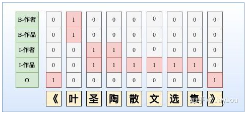
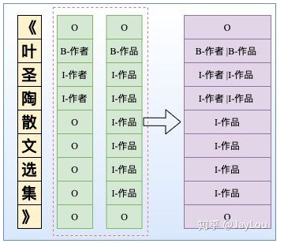
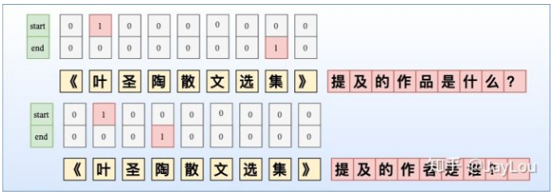
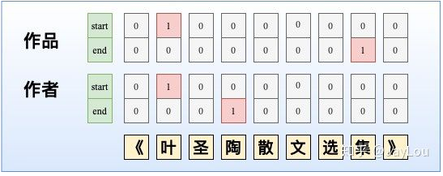
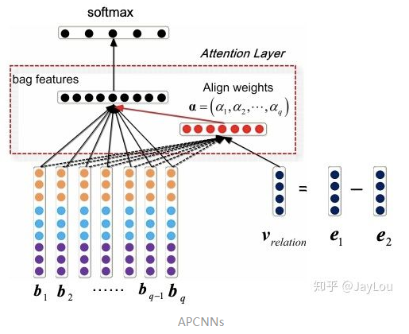
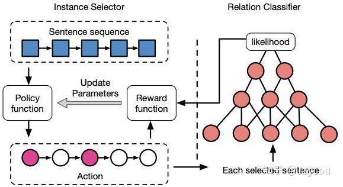
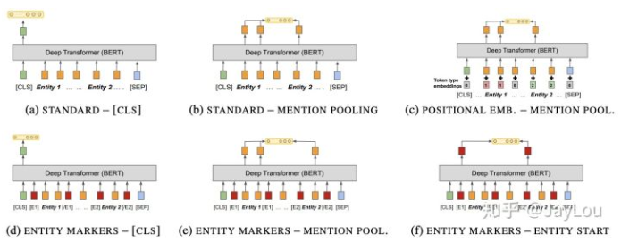
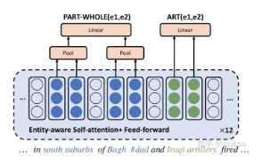
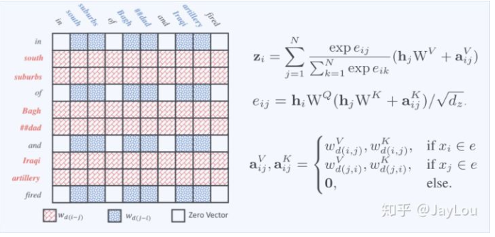
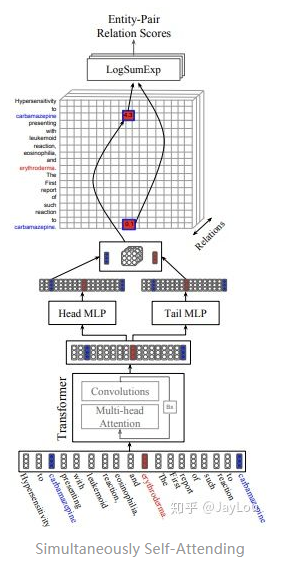

# nlp中的实体关系抽取方法总结

## 1. 学习资料

1. [DeepIE](https://link.zhihu.com/?target=https%3A//github.com/loujie0822/DeepIE)

说明：基于深度学习的信息抽取技术集散地，欢迎大家关注，包含实体、关系、属性、事件、链接&标准化等。

## 2. Question LIst 

- Q1：与联合抽取对比，Pipeline方法有哪些缺点？
- Q2：NER除了LSTM+CRF，还有哪些解码方式？如何解决嵌套实体问题？
- Q3：Pipeline中的关系分类有哪些常用方法？如何应用弱监督和预训练机制？怎么解决高复杂度问题、进行one-pass关系分类？
- Q4：什么是关系重叠问题？
- Q5：联合抽取难点在哪里？联合抽取总体上有哪些方法？各有哪些缺点？
- Q6：介绍基于共享参数的联合抽取方法？
- Q7：介绍基于联合解码的联合抽取方法？
- Q8：实体关系抽取的前沿技术和挑战有哪些？如何解决低资源和复杂样本下的实体关系抽取？如何应用图神经网络？

## 3. ERE 介绍

实体关系抽取（Entity and Relation Extraction，ERE）是信息抽取的关键任务之一。ERE是级联任务，分为两个子任务：实体抽取和关系抽取，如何更好处理这种类似的级联任务是NLP的一个热点研究方向。

## 4. 方法介绍及优缺点

### 4.1 Pipeline 方法

#### 4.1.1 介绍

Pipeline方法指先抽取实体、再抽取关系。相比于传统的Pipeline方法，联合抽取能获得更好的性能。

#### 4.1.2 优缺点

##### 4.1.2.1 优点

实体模型和关系模型可以使用独立的数据集，并不需要同时标注实体和关系的数据集

##### 4.1.2.2 缺点

1. 误差积累：实体抽取的错误会影响下一步关系抽取的性能。
2. 实体冗余：由于先对抽取的实体进行两两配对，然后再进行关系分类，没有关系的候选实体对所带来的冗余信息，会提升错误率、增加计算复杂度。
3. 交互缺失：忽略了这两个任务之间的内在联系和依赖关系。

（基于共享参数的联合抽取方法仍然存在训练和推断时的gap，推断时仍然存在误差积累问题，可以说只是缓解了误差积累问题。）

### 4.2 NER除了LSTM+CRF，还有哪些解码方式？如何解决嵌套实体问题？

#### 4.2.1 引言

虽然NER是一个比较常见的NLP任务，通常采用LSTM+CRF处理一些简单NER任务。NER还存在嵌套实体问题（实体重叠问题），如「《叶圣陶散文选集》」中会出现两个实体「叶圣陶」和「叶圣陶散文选集」分别代表「作者」和「作品」两个实体。而传统做法由于每一个token只能属于一种Tag，无法解决这类问题。笔者尝试通过归纳几种常见并易于理解的 实体抽取解码方式 来回答这个问题。

#### 4.2.2 系列标注：softmax 和 CRF

本质上是token-level 的多分类问题，通常采用CNNs/RNNs/BERT+CRF处理这类问题。与SoftMax相比，CRF进了标签约束。对这类方法的改进，介绍2篇比较有价值的工作：

- 针对CRF解码慢的问题，LAN[1]提出了一种逐层改进的基于标签注意力机制的网络，在保证效果的前提下比 CRF 解码速度更快。文中也发现BiLSTM-CRF在复杂类别情况下相比BiLSTM-softmax并没有显著优势。
- 由于分词边界错误会导致实体抽取错误，基于LatticeLSTM[2]+CRF的方法可引入词汇信息并避免分词错误（词汇边界通常为实体边界，根据大量语料构建词典，若当前字符与之前字符构成词汇，则从这些词汇中提取信息，联合更新记忆状态）。

##### 4.2.2.1 针对 重叠实体问题 提出 的改进方法

但由于这种序列标注采取BILOU标注框架，每一个token只能属于一种，不能解决重叠实体问题，如图所示。

基于BILOU标注框架，笔者尝试给出了2种改进方法去解决实体重叠问题：

1. 改进方法1

采取token-level 的多label分类，将SoftMax替换为Sigmoid，如图所示。当然这种方式可能会导致label之间依赖关系的缺失，可采取后处理规则进行约束。

2. 改进方法2

依然采用CRF，但设置多个标签层，对于每一个token给出其所有的label，然后将所有标签层合并。显然这可能会增加label数量[3]，导致label不平衡问题。基于这种方式，文献[4]也采取先验图的方式去解决重叠实体问题。

#### 4.2.3 Span抽取：指针网络

##### 4.2.3.1 引言

指针网络（PointerNet）最早应用于MRC中，而MRC中通常根据1个question从passage中抽取1个答案片段，转化为2个n元SoftMax分类预测头指针和尾指针。对于NER可能会存在多个实体Span，因此需要转化为n个2元Sigmoid分类预测头指针和尾指针。

##### 4.2.3.2 常用方式

第一种：**MRC-QA+单层指针网络**。在ShannonAI的文章中[5]，构建query问题指代所要抽取的实体类型，同时也引入了先验语义知识。如图所示，由于构建query问题已经指代了实体类型，所以使用单层指针网络即可；除了使用指针网络预测实体开始位置、结束位置外，还基于开始和结束位置对构成的所有实体Span预测实体概率[6]。此外，这种方法也适合于给定事件类型下的事件主体抽取，可以将事件类型当作query，也可以将单层指针网络替换为CRF。

第二种：**多层label指针网络**。由于只使用单层指针网络时，无法抽取多类型的实体，我们可以构建多层指针网络，每一层都对应一个实体类型。

##### 4.2.3.3 注意

1. MRC-QA会引入query进行实体类型编码，这会导致需要对愿文本重复编码输入，以构造不同的实体类型query，这会提升计算量。
2. 笔者在实践中发现，n个2元Sigmoid分类的指针网络，会导致样本Tag空间稀疏，同时收敛速度会较慢，特别是对于实体span长度较长的情况。

#### 4.2.4 片段排列+分类

##### 4.2.4.1 引言

上述序列标注和Span抽取的方法都是**停留在token-level进行NER**，**间接去提取span-level的特征**。而**基于片段排列的方式**[7]，显示的提取所有可能的片段排列，由于选择的每一个片段都是独立的，因此可以直接提取span-level的特征去解决重叠实体问题。

对于含T个token的文本，理论上共有 $N=T(T+1)/2$ 种片段排列。如果文本过长，会产生大量的负样本，在实际中需要限制span长度并合理削减负样本。

##### 4.2.4.2 注意

1. 实体span的编码表示：在span范围内采取注意力机制与基于原始输入的LSTM编码进行交互。然后所有的实体span表示并行的喂入SoftMax进行实体分类。
2. 这种片段排列的方式对于长文本复杂度是较高的。

#### 4.2.5 Seq2Seq

ACL2019的一篇paper中采取Seq2Seq方法[3]，encoder部分输入的原文tokens，而decoder部分采取hard attention方式one-by-one预测当前token所有可能的tag label，直至输出<eow> (end of word) label，然后转入下一个token再进行解码。

### 4.3 Q3：Pipeline中的关系分类有哪些常用方法？如何应用弱监督和预训练机制？怎么解决高复杂度问题、进行one-pass关系分类？

#### 4.3.1 引言

Pipeline方法中，关系抽取通常转化为一个分类问题，笔者这里称之为「关系分类」

#### 4.3.2 模板匹配

是关系分类中最常见的方法，使用一个模板库对输入文本两个给定实体进行上下文匹配，如果满足模板对应关系，则作为实体对之间的关系。常见的模板匹配方法主要包括：

- 人工模板：主要用于判断实体间是否存在上下位关系。上下位关系的自然语言表达方式相对有限，采用人工模板就可以很好完成关系分类。但对于自然语言表达形式非常多的关系类型而言，这就需要采取统计模板。
- 统计模板：无须人工构建，主要基于搜索引擎进行统计模板抽取。具体地，将已知实体对作为查询语句，抓取搜索引擎返回的前n个结果文档并保留包含该实体对的句子集合，寻找包含实体对的最长字串作为统计模板，保留置信度较高的模板用于关系分类。

基于模板匹配的关系分类构建简单、适用于小规模特定领域，但召回率低、可移植性差，当遇到另一个领域的关系分类需要重新构建模板。

#### 4.3.3 半监督学习

##### 4.3.3.1 bootstrapping（自举）

利用少量的实例作为初始种子集合，然后在种子集合上学习获得关系抽取的模板，再利用模板抽取更多的实例，加入种子集合中并不断迭代。

- bootstrapping比较常见的方法有DIPRE和Snowball。和DIPRE相比，Snowball通过对获得的模板pattern进行置信度计算，一定程度上可以保证抽取结果质量。
- bootstrapping的优点构建成本低，适合大规模的关系任务并且具备发现新关系的能力，但也存在对初始种子较为敏感、存在语义漂移、准确率等问题。

##### 4.3.3.2 远程监督

1. 基本假设

**如果一个实体对满足某个给定关系，那么同时包含该实体对的所有句子（构成一个Bag）都可能在阐述该关系**。可以看出，该假设是一个非常强的假设，实际上**很多包含该实体对的句子并不代表此种关系**，会**引入大量噪声**。为了缓解这一问题，主要采取「多示例学习」、「强化学习」和「预训练机制」：

2. 类别

- 多示例学习

主要基于Bag的特征进行关系分类，主要代表文献包括PCNN[8]、Selective Attention over Instances[9]、Multi-label CNNs[10]、APCNNs[11]，其中Bag的表示主要方式和池化方式为：

以APCNNs为例，采取PCNN模型[8]**提取单一句子的特征向量，最后通过attention加权得到Bag级别的特征**，关系分类是基于Bag特征进行的，而原始的PCNN模型只选择Bag中使得模型预测得分最高的句子用于模型参数的更新，这会损失很多信息。

- 强化学习

在采用多示例学习策略时，可能会出现整个Bag包含大量噪声的情况。基于强化学习的CNN+RL[12]比句子级别和Bag级别的关系分类模型取得更好效果。

模型主要由样例选择器和关系分类器构成。样例选择器负责从样例中选择高质量的句子，采取强化学习方式在考虑当前句子的选择状态下选择样例；关系分类器向样例选择器反馈，改进选择策略。

- 预训练机制

采取“Matching the Blank[13]”方法，首次在预训练过程中引入关系分类目标，但仍然是自监督的，没有引入知识库和额外的人工标注，将实体metion替换为「BLANK」标识符。

  - 该方法认为包含相同实体对的句子对为正样本，而实体对不一样的句子对为负样本。如图， $r_A$ 和 $r_B$ 构成正样本，$r_A$ 和 $r_C$ 构成  $r_B$ 和 $r_C$ 构负样本。
  - 不同于传统的远程监督，该方法训练中不使用关系标签，采用二元分类器对句子对进行相似度计算。预训练的损失包含2部分：MLM loss 和 二元交叉熵关系损失。
  - 在FewRel数据集上，不进行任何tuning就已经超过了有监督的结果。

#### 4.3.3.3 监督学习

##### 4.3.3.3.1 类别

- 基于特征的方法需要定义特征集合；
- 核函数不需要定义特征集合、在高维空间进行计算；
- 深度学习：很多基于深度学习的有监督关系分类被提出，大致都采用CNN、RNN、依存句法树、BERT的方法，由于这些方法大都很容易理解，笔者这里不再赘述，只选择介绍3篇比较新颖的文献进行介绍。

##### 4.3.3.3.2 论文介绍

###### 4.3.3.3.2.1 Matching the Blanks: Distributional Similarity for Relation Learning[13]

这篇文献来自GoogleAI，基于BERT，共采用6种不同结构来进行实体pair的pooling，然后将pooling进行关系分类或关系相似度计算，显示(f)效果最好。

- 标准输入+「CLS」输出；
- 标准输入+mention pooling输出；
- position embedding 输入+mention pooling输出；
- entity markers输入+「CLS」输出；
- entity markers输入+ mention pooling输出；
- entity markers输入+ entity start 输出；

###### 4.3.3.3.2.2 MExtracting Multiple-Relations in One-Pass with Pre-Trained Transformers[14]

Pipeline方法下的关系分类，同一个句子会有多个不同的实体对，过去的一些方法构造多个（句子，entity1，entity2）进行多次关系分类，本质上是一个multi pass问题，同一个句子会进行重复编码，耗费计算资源。

- 本文将多次关系抽取转化为one pass问题，将句子一次输入进行多个关系分类。在BERT顶层对不同的实体对进行不同的关系预测。
- 本文将还编码词和实体之间的相对距离计算Entity-Aware Self-Attention。如下图所示， $w_d(i-j)$ 代表实体 $x_i$ 到token $x_j$ 间相对距离的 embedding。

###### 4.3.3.3.2.3 Simultaneously Self-Attending to All Mentions for Full-Abstract Biological Relation Extraction[15]

与上篇文献[14]类似，这篇文献的依旧采用one-pass对所有实体mention进行关系分类，同时从所有实体mention中定位关系。

不同的地方是从句子级别拓展到文档级别，同时引入NER辅助进行多任务学习，此外，实体信息在进行mention pooling才给定，而不是输入时就给出 ；进行关系分类时采用Bi-affine方法(sigmoid)，而不是采用Softmax。具体地：

- Bi-affine Pairwise Scores：采用Transformer编码，对每个token通过两个独立MLP进行三元组中的head和tail表征，然后Bi-affine通过计算每个三元组的得分：

- 采用LogSumExp计算得分：

- 计算loss时，给定E个实体对信息再进行计算：

https://zhuanlan.zhihu.com/p/77868938

D:\project\python_wp\nlp\nlp_paper_study\ERE_study\img