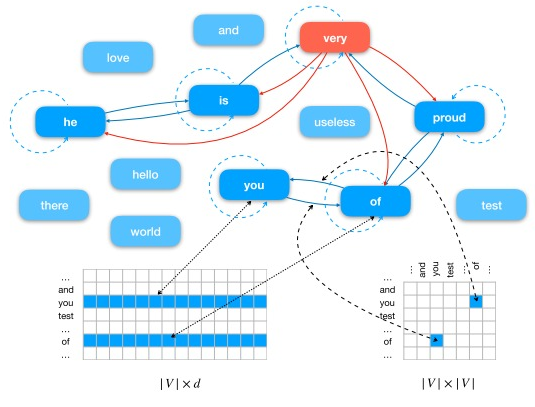
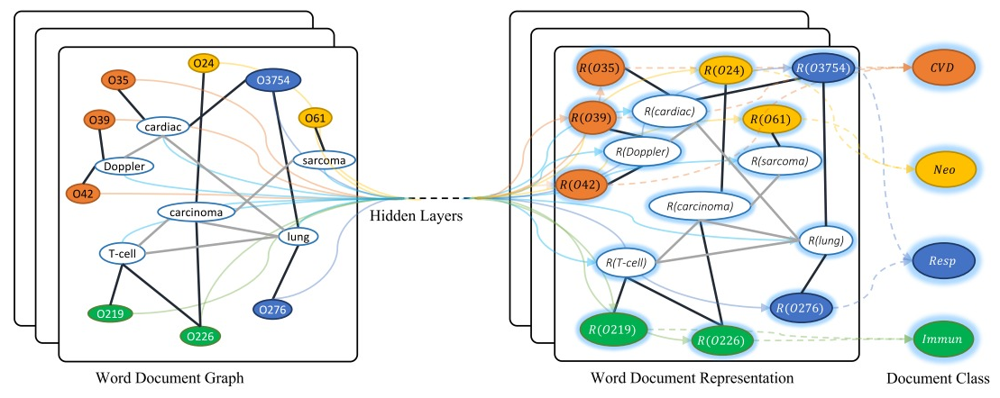
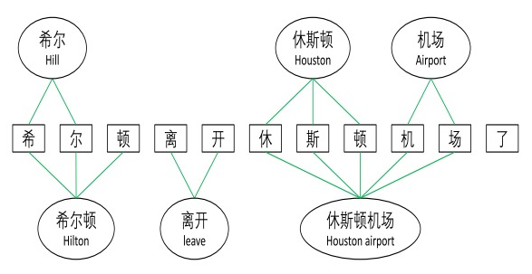
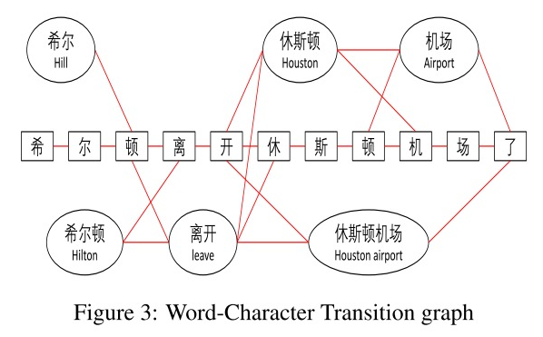
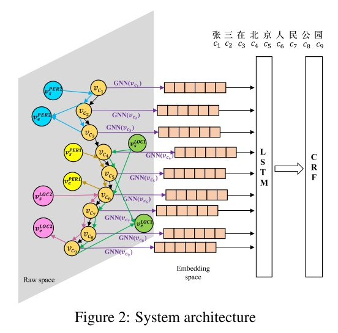

# 【关于 GCN in NLP 】那些你不知道的事

> 作者：杨夕
> 
> 项目地址：https://github.com/km1994/nlp_paper_study
>
> 【注：手机阅读可能图片打不开！！！】

## NLP 中 常见的构图方法

GCN 要用于 NLP 领域，首先需要将 文本转化为 Graph 结构，常见的 构图方法：

1. 句法依赖树；
2. TF-IDF;
3. PMI;
4. 序列关系；
5. 词典

### 论文介绍

####  Text Level Graph Neural Network for Text Classification (EMNLP2018)[1]

##### 构图方法

- Graph 中节点：将文本中 所有的 word 转化为 Graph 中 的 节点；
- Graph 中边：利用边表示 相邻 words 间 的 相邻关系；

> 对于句子 “he is very proud of you”

#### Graph Convolutional Networks for Text Classification (AAAI2019)[2]

##### 构图方法

- Graph 中节点：
  - words 作为 Graph 中节点；
  - documents 作为 Graph 中节点；
- Graph 中边：
  - word-document：word 在 document 内的 TF-idf 值作为 Graph 中 word-document 边的权值；
  - word-word：word 和 word 间的 PMI 值 作为  Graph 中 word-word 边的权值；

##### 公式

$$\begin{aligned}
\operatorname{PMI}(i, j) &=\log \frac{p(i, j)}{p(i) p(j)} \\
p(i, j) &=\frac{\# W(i, j)}{\# W} \\
p(i) &=\frac{\# W(i)}{\# W}
\end{aligned}$$

> #W 表示所有划动窗口的数量;
> $#W(i)$表示所有含有 $word_i$ 划动窗口的数量;
> $#W(i,j)$ 表示同时含有 $word_i$ 和 $word_j$ 两个词窗口的数量。
> 其中， PMI值为正，说明语义相关性较高，为负，则说明语义相关性较少甚至没有

##### 构图方法

#### A Lexicon-Based Graph Neural Network for Chinese NER(EMNLP2019) [3]

##### 构图方法

- 每个句子被转化为一个有向图
- Graph 中节点：
  - 句子中每个字符 作为 Graph 中节点；
  - 全局的中继节点：它与图中的每个边和点都相连， 用来汇聚所有边和点的信息，从而消除词语之间的边界模糊，图中任意两个不邻接的节点之间都是彼此的二阶邻居，可以通过两次节点更新来接收彼此的非局部的信息；
- Graph 中边：
  - lexicon word：第一个和最后一个字符间构建一条边, 每条边代表了潜在的可能存在词语(即lexicon word)的特征；
  - word-word：word 和 word 间的 PMI 值 作为  Graph 中 word-word 边的权值；

另外，对以上的图结构进行转置得到一个所有边都反向后的反向图，将反向图与原图中得到的字符表示进行拼接，作为最终的字符表示；

#### Leverage Lexical Knowledge for Chinese NER via Collaborative Graph Network(EMNLP2019)[4]

##### 构图方法

论文构建三种图：

- Containing-Graph(C-Graph)
  - 作用：辅助字符去捕捉对应self-matched lexicon word的语义信息和边界信息；
  - 点集：句子中的字符 和 lexicon words;
  - 构图如下：

- Transition-Graph(T-Graph)
    - 作用：捕捉字符最近上下文的语义信息；
    - 点集: 句子中的字符和 lexicon words
    - 构图如下: 建立 lexicon words 与 字符 间 和 lexion words间 的转移关系图
  

- Lattice-Graph(L-Graph)
  - 作用：融合 lexicon knolwedge, 且将 Lattice 的 LSTM 结构转变为了图结构;
  - 点集: 句子中的字符和 lexicon words；
  - 构图如下：
  

#### A Neural Multi-digraph Model for Chinese NER with Gazetteers(ACL2019)[5]

##### 构图方法

- Graph 中节点：预料中的每个字符作为一个节点；同时，根据 gazetteer 提供的 entity type 信息，引入标识类型的节点, 例如 $PER^1, PER^2,LOC^1,LOC^2 $;
- Graph 中边：首先，相邻的字符间构建一条有向边； 然后，根据 entity 所匹配的实体，在节点类型点与对应entity的起始字符节点和结尾字符节点间建立连边。例如，根据gazetteers认为由字符 $c_1,c_2$；组成的 张三一词是PER2类型的实体，则构建如下边:$(v_{c_1},v_{c_2}),(v_{s}^{PER2},v_{c_1}),(v_{c_2},v_{e}^{PER2})$, 其中(v_{s}^{PER2})和(v_{e}^{PER2})是表示 $PER2$ 起始和终止的节点。

#### Tensor Graph Convolutional Networks for Text Classification(AAAI2020)[6]

##### 构图方法

- Graph 中节点：
  - words 作为 Graph 中节点；
  - documents 作为 Graph 中节点；
- Graph 中边：
  - word-document：word 在 document 内的 TF-idf 值作为 Graph 中 word-document 边的权值；
  - word-word：
    - Semantic-based graph

    通过LSTM得到每个word的表示，通过余弦相似性计算两个word间的语义相似性，**如果语义相似性达到一定的阈值，则认为两words之间存在语义关系**；对于存在语义关系的words, 将通过如下方法计算他们之间的边权值：

    $$d_{\text {semantic }}\left(w_{i}, w_{j}\right)=\frac{\# N_{\text {semantic }}\left(w_{i}, w_{j}\right)}{\# N_{\text {total }}\left(w_{i}, w_{j}\right)}$$

    - Syntactic-based graph

    根据句法依赖解析关系构建 words 之间的边，并通过如下方式计算边权重:

    $$d_{\text {syntactic }}\left(w_{i}, w_{j}\right)=\frac{\# N_{\text {syntactic }}\left(w_{i}, w_{j}\right)}{\# N_{\text {total }}\left(w_{i}, w_{j}\right)}$$

    - Sequential-based Graph

    序列上下文信息描述了词语之间的共现信息，序列图中边权重通过PMI来计算:

    $$d_{\text {sequential }}\left(w_{i}, w_{j}\right)=\log \frac{p\left(w_{i}, w_{j}\right)}{p\left(w_{i}\right) p\left(w_{j}\right)}$$

## 参考资料

1. [EMNLP2018: Text Level Graph Neural Network for Text Classification](https://www.aclweb.org/anthology/D19-1345/)
2. [AAAI2019: Graph Convolutional Networks for Text Classification](https://wvvw.aaai.org/ojs/index.php/AAAI/article/view/4725) [code](https://github.com/kuoluo1995/text-classification)
3. [EMNLP2019: A Lexicon-Based Graph Neural Network for Chinese NER](https://www.aclweb.org/anthology/D19-1396.pdf)
4. [EMNLP2019: Leverage Lexical Knowledge for Chinese NER via Collaborative Graph Network](https://www.aclweb.org/anthology/D19-1396.pdf)
5. [ACL2019: A Neural Multi-digraph Model for Chinese NER with Gazetteers](https://www.aclweb.org/anthology/P19-1141.pdf)
6. [AAAI2020: Tensor Graph Convolutional Networks for Text Classification](https://arxiv.org/abs/2001.05313)
