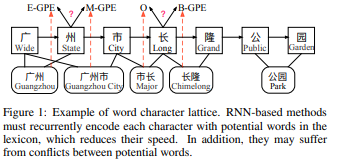
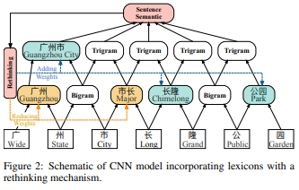
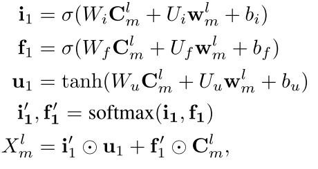
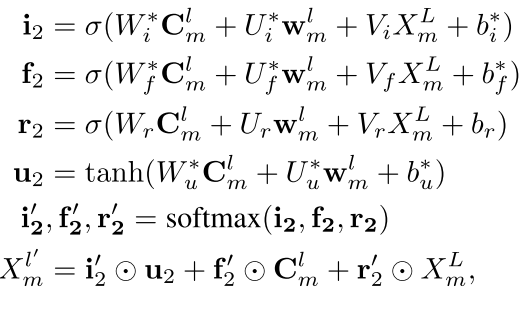
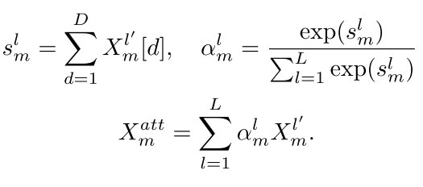

# LR-CNN:CNN-Based Chinese NER with Lexicon Rethinking(IJCAI2019)

> 论文：
> 源码：[LR-CNN]()

## 摘要

Character-level Chinese named entity recognition (NER) that applies long short-term memory (LSTM) to incorporate lexicons has achieved great success.

 However, this method fails to fully exploit GPU parallelism and candidate lexicons can conflict.

 - 动机
   - 充分利用 GPU 问题
   - 词汇信息冲突问题
 
 In this work, we propose a faster alternative to Chinese NER: a convolutional neural network (CNN)-based method that incorporates lexicons using a rethinking mechanism. The proposed method can model all the characters and potential words that match the sentence in parallel. In addition, the rethinking mechanism can address the word conflict by feeding back the high-level features to refine the networks. 
 
 Experimental results on four datasets show that the proposed method can achieve better performance than both word-level and character-level baseline methods. In addition, the proposed method performs up to 3.21 times faster than state-of-the-art methods, while realizing better performance.

 ## 动机

 - 词信息引入问题；
 - lattice LSTM 问题：
   - 基于 RNN 结构方法不能充分利用 GPU 并行计算资源；
     - 1. 针对句子中字符计算；
     - 2. 针对匹配词典中潜在词
   - 很难处理被合并到词典中的潜在单词之间的冲突：
     - 一个字符可能对应词典中多个潜在词，误导模型、
  

> 字符 [长] 可以匹配到词汇 [市长] 和 [长隆]，不同的匹配会导致[长] 得到不同的标签

## 论文思路

- Lexicon-Based CNNs：采取CNN对字符特征进行编码，感受野大小为2提取bi-gram特征，堆叠多层获得multi-gram信息；同时采取注意力机制融入词汇信息（word embed）；
- Refining Networks with Lexicon Rethinking：由于上述提到的词汇信息冲突问题，LR-CNN采取rethinking机制增加feedback layer来调整词汇信息的权值：具体地，将高层特征作为输入通过注意力模块调节每一层词汇特征分布，利用这种方式来利用高级语义来完善嵌入单词的权重并解决潜在单词之间的冲突。

> 高层特征得到的 [广州市] 和 [长隆]会降低 [市长] 在输出特征中的权重分布。最终对每一个字符位置提取对应的调整词汇信息分布后的multi-gram特征，喂入CRF中解码。

### Lexicon-Based CNNs

- 动机：如何充分利用 GPU 并行计算资源
- 方法
  - 句子表示：将输入句子表示为 $C=c_1,c_2,...,c_n$;($c_i$ 表示句子中第$i$个字符维度为$d$的 wmbedding);
  - 词典匹配：利用词典匹配输入句子中词语，并表示为$w^l_m={c_m,..,c_{m+l-1}}$;($m$表示字符下标，$l$表示词语长度，如上图 $w^2_i$=广州，$w^3_1$=广州市)；
  - CNN 模型编码：利用 CNN 模型对字符序列进行编码，并通过 Attention 模块融合 词典 信息。采用窗口大小为 l 的卷积核提取 l-gram 特征 $C^l_m$，并将对应的 $w^l_m$ 通过 Attention 操作融入 词典信息：

### Refining Networks with Lexicon Rethinking

- 动机：CNN 的分层结构，容易造成底层 potential words 信息 无法影响高层 words，所以采用 rethinking 机制处理词汇中的 potential words 的冲突问题
- 方法
  - CNN的顶层特征 $X^L_m$作为高层特征，通过向每一层CNN添加一个feedback layer来调整lexicon的权值，具体计算如下:

> 举例：如果没有高层特征得到的"广州市"和"长隆"，那么"市长"一词会对误导模型对字符"市"产生错误的预测。因此，需要通过高层特征(“广州市”)来降低"市长"一词在输出特征中权重。

  - 在通过卷积核抽取 l−gram 特征的同时，句子中每个位置上的字符分别都得到了一个表示，因此通过 Attention 机制将同一字符在不同卷积尺度下的特征进行融合:

  - 最后得到的$X_{att}=\{X^{att}_1,X^{att}_2, ..., X^{att}_M\}$ 将作为CRF层进行标签预测的输入。

### Predicting with CRF

  以$X_{att}$为输入，通过CRF层对字符标签进行预测

## 论文贡献

 1) We propose a novel CNN structure for incorporating lexicons into Chinese NER, which effectively accelerates the model training by its use of parallelism; 
 2) we apply a rethinking mechanism to tackle the conflict between potential words in the lexicon, and the proposed model can leverage the highlevel semantic to identify the correct words; 
 3) experimental results on four datasets demonstrate that the proposed model can achieve better performance, and performs up to 3.21 times faster than state-of-the-art methods.

## 论文总结

- 动机
  - 如何充分利用 GPU 资源；
  - 如何解决词汇冲突问题；
- 方法
  - Lexicon-Based CNNs：利用 卷积核提取 字符特征，然后利用 Attention 融入 词典信息；
  - Refining Networks with Lexicon Rethinking： CNN的顶层特征 $X^L_m$作为高层特征，通过向每一层CNN添加一个feedback layer来调整lexicon的权值
