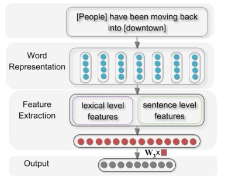
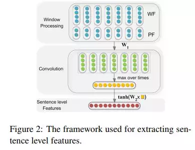
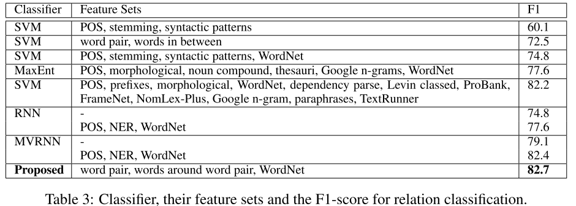
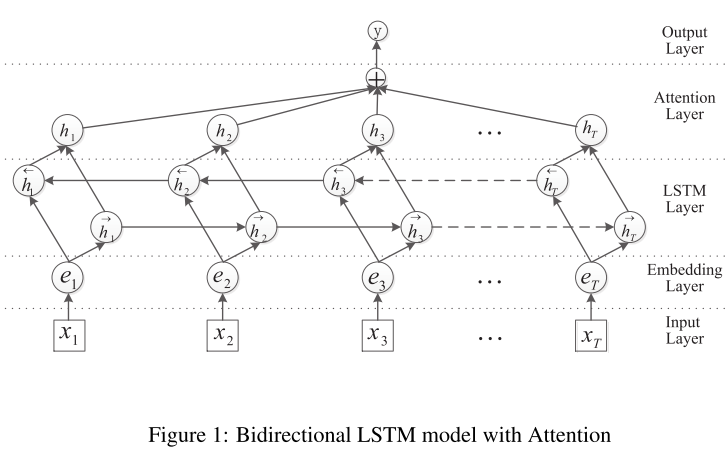
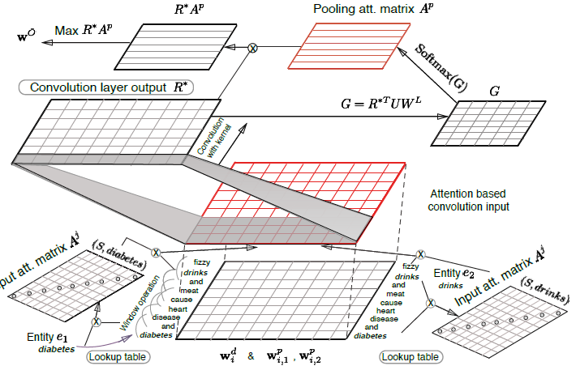
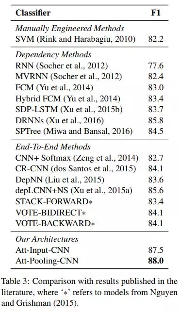

## 关系抽取（分类）论文总结

### 基本介绍
#### 基本定义

- 关系分类：判断给定实体对（e1,e2）在句子中所表达出的关系，属于多分类问题。
- 关系抽取：从一个句子中判断两个实体是否存在关系，属于二分类问题，指定某种关系。
  
#### 常用数据集

- ACE 2005
  介绍：599 docs， 7 types
- SemiEval 2010 Task8 Dataset:
  - 19  types;
  - train data: 8000;
  - test data: 2717;
- NYT+FreeBase 通过Distant Supervised ;method 提取，里面会有噪音数据：
  - 53 types;
  - train data: 522611 sentence; **里面存在近80%的句子的标签为 NA**;
  - test data: 172448 sentence;


### 学习方法分类

- Fully Supervised Learning
  
  所用的数据集为 label 完全正确的 SemEval 2010 Task 8 数据集，该数据集的训练数据样例：
  
```
The <e1>microphone</e1> converts sound into an electrical <e2>signal</e2>.
Cause-Effect(e1,e2)
Comment:
```
其中，第一行为 sentence,第二行为两个实体间的关系，第三行为备注。

- Distant Supervised Learning
  
  所用的数据集为 NYT+FreeBase 数据集，该数据集的训练数据样例：

```
m.0ccvx    m.05gf08    queens    belle_harbor    /location/location/contains    .....officials yesterday to reopen their investigation into the fatal crash of a passenger jet in belle_harbor , queens...... ###END###
```
一共为6列，前两列为两个entity的Freebase mid，第三四列为两个entity在句子中的string。第五列为relation，最后一列为sentence（有省略），以###END###结尾

- Joint Learning with wntity and relation
- Tree Bassed Methods

#### Fully Supervised Learning

##### 一、Relation Classification via Convolutional Deep Neural Network

> Zeng,et.al. (2014). Relation Classification via Convolutional Deep Neural Network. Coling, 2335–2344
> 
> 论文地址：https://www.aclweb.org/anthology/C14-1220
> 
> 读书笔记：https://mp.weixin.qq.com/s?__biz=MzAxMTU5Njg4NQ==&mid=100001827&idx=4&sn=e23122678e7a297df8cbc403456a0989
> 
> 论文源码地址：
> 
>  - pytorch实现：https://github.com/Thidtc/Relation-Classification-via-Convolutional-Deep-Neural-Network
> 
>  - tensorflow实现: https://github.com/FrankWork/conv_relation

1. 论文动机

- 针对之前的关系抽取方法大多数是基于统计机器学习的方法，这种方法虽然能够获得不错的效果，但是由于该方法的性能取决于所提取的特征的质量，因此存在局限性;
- 相比于RNN，CNN 对长距离位置建模存在局限性;

2. 论文思路
   
   本篇论文的模型框架包含三部分：Word Representation, Feature Extraction, and Output，整体框架如下图所示：

   

    - Word Representation Layer：本文采用 [Turian 2010ACL] 的 Pre-Train 的词向量；
    - Feature Extraction Layer：分别提取 Lexical Leval Feature 和 Sentence Leval Feature；
    - Output Layer：最后直接将 Lexical Leval Feature 和 Sentence Leval Feature 进行拼接，并输入到一个全连接层+Softmax，以进行关系分类。

    2.1. Word Representation Layer

    2.2. Feature Extraction Layer

    (1) Lexical-Feature

    Lexical-Feature 一共分为以下5部分，如下图所示：

      

      - L1: entity1
      - L2: entity2
      - L3: entity1 左右两边的tokens
      - L4: entity2 左右两边的tokens
      - L5: WordNet 中两个entity 的上位词
  
     举个栗子，对于下面这段话：

     > The [haft] of the [axe] is made of yew wood.

      - L1: entity1：haft
      - L2: entity2：axe
      - L3: entity1’s 上下文：the, of
      - L4: entity2’s 上下文：the, is
      - L5: 在wordNet中找到两个entity的上位词。上位词就是包含关系，比如parrot这个词的上位词就是bird. 这种包含关系其实类似于指明了实体的类型特征。

     将这些 Features 拼接起来，作为最后的 Lexical Level Features。

    (2) Sentence-Feature

    本文提出 CNN 来获取 Sentence Level representation 和自动提取 Sentence Level Feature，该模型架构如下图所示：

    


    (2.1) Window Processing Layer 中每个词包含两种特征：
    - WF(word feature)：词向量
    - PF(position feature)：位置特征，针对 CNN 存在无法捕获长距离特征及语义成分，本文采用了 位置特征。每个 word 与两个entity将的相对距离。如下图所示：

    

    > 图中，单词 been 距离 entity1 的距离为 2，距离 entity2 的距离为-4.

    > 这样每个word 就有了两个位置特征[d1,d2]，这两个特征也需要再额外使用Lookup-Table 做Embedding，投影成低维向量，也就是每个相对距离，都对应到一个低维实数向量。 这个Position Feature 的引入其实是突出了两个entity的作用，实验证明PF对效果的提升很明显。   

    因此，每个 word 的 Sentence Level Feature 维度为：$d_w + d_p * 2$，其中，$d_w$为word embedding 的维度，$d_p$为position embedding 的维度。

    (2.2) 卷积操作

    为了获取 Sentence Level Feature，本文首先采用卷积提取特征，然后使用 Max Pooling 操作提取每个卷积核中最有用的特征，最后，利用一个全连接层提取 Sentence Level Feature。

    2.3. Output Layer

    最后将 Lexical Level Feature 和 Sentence Level Feature 拼接成一个向量 $f=[l,g]$，作为整个句子的 Feature。
    最后将这些Feature输入全连接层和softmax分类器，即可进行关系分类。

3. 实验

    实验结果如下表所示。

    


4. 个人点评

   - 优点
     - 使用Pooling 操作，提取了每一个卷积核对应的最优特征；
     - 引入Position Feature: 相当于在一定程度上引入了位置信息，因为CNN更多是局部N-Gram特征; PF突出了entity的影响，包括后续的PieceWise Max Pooling，同样也是对entity与其他词分开考虑。
   - 缺点
     - 虽然使用了多个卷积核，但是仅仅使用同一个window-size, 提取特征比较单一；
     - 结构还是相对简单，更多的是类似于CNN 文本分类的结构。 而且还是加入了人为构造的Lexical Feature。


##### 二、Attention-Based Bidirectional Long Short-Term Memory Networks for Relation Classification

> Zhou. (2016). Attention-Based Bidirectional Long Short-Term Memory Networks for Relation Classification. ACL
> 
> 论文地址：https://www.aclweb.org/anthology/C14-1220
> 
> 读书笔记：https://mp.weixin.qq.com/s?__biz=MzAxMTU5Njg4NQ==&mid=100001827&idx=2&sn=27cd33fa69eaf376a92352f65b293e90
> 
> 论文源码地址：
> 
>  - tensorflow实现: https://github.com/crownpku/Information-Extraction-Chinese/tree/master/RE_BGRU_2ATT
> 
>  - 复现版本：https://github.com/km1994/relation_extraction_study/tree/master/Attention-Based-BiLSTM-relation-extraction

1. 论文动机

   - 最新的系统仍然依赖于词典资源，例如wordNet或者NLP系统，像依赖解析器和命名实体识别，以获得高级特征;
   - 重要信息可以出现在句子的任何位置;
   - 手动设计功能非常耗时，并且由于不同训练数据集的覆盖率较低而导致通用性较差。

2. 论文思路

    本文提出了一种新的神经网络Att-BLSTM用于关系分类。 我们的模型利用双向长短期记忆网络（BLSTM）的神经注意机制来捕获句子中最重要的语义信息。该框架如下图所示：

    

    - Input Layer： 将句子输入到模型中；
    - Embedding Layer：将每个词映射到低维度向量中；
    - BiLSTM Layer：利用 BiLSTM 获取句子中Sentence Level Feature；
    - Attention Layer：生成权重向量，并通过乘以权重向量将每个时间步长的词级特征合并到Sentence Level Feature向量中；设$H=[h_1,h_2,h_3,..h_T]$为BiLSTM的所有step的输出矩阵，$T$为句子长度. 然后经过下面的操作来计算每个step的权重:
    

        这样$α$ 就是weight vector, $r$就是最终的Attention-BiLSTM的输出，也即sentence的embedding, 之后使用了softmax来分类，损失函数使用对数似然。

    - Output Layer：最后将 Sentence Level Feature 向量用于关系分类。

3. 实验
   
   实验结果如下表所示：

   


4. 个人点评

    作为 NLP 任务中标配 Attention + BiLSTM 一直被用于不同的 NLP 任务中，所以本文并没有什么比较大的创新点。 

##### 三、Relation Classification via Multi-Level Attention CNNs

> Wang. (2016). Relation Classification via Multi-Level Attention CNNs. ACL
> 
> 论文地址：http://iiis.tsinghua.edu.cn/~weblt/papers/relation-classification.pdf
> 
> 读书笔记：https://mp.weixin.qq.com/s?__biz=MzAxMTU5Njg4NQ==&mid=100001827&idx=5&sn=f125b23b172f9755c0f02991919deee6 
> 
> 论文源码地址：
> 
>   - tensorflow 版本：https://github.com/lawlietAi/relation-classification-via-attention-model


1. 论文动机
   
    - 关系表达的多样性问题；
    - 虽然，深度学习模型能够在不需要手工特征工程或外部资源的情况下，捕获相应的信息和特征，但是，这些模型无法识别批判性线索和对外部知识存在依赖。

2. 论文思路
   
https://github.com/km1994/relation_extraction_study/blob/master/T3_RC_via_attention_model_new/img/acnn_structure.png

    本文提出了一个多级别的基于注意力的卷积神经网络模型，如下图所示：

    

    设计了相对复杂的两层Attention机制来尽可能突出句子中哪些部分对relation label有更大的贡献。使用了word similarity来定义句子中word与target entity的相似度，从而根据相似度来引入权重，这是第一层的Attention. 第二层Attention则是对卷积之后Pooling阶段，采用Attention Pooling 而不是Max Pooling. 通过这些操作来减弱噪音，加强相关性强的词的权重。此外也改进了前面Santos提出的Ranking Loss. 下面对文中详细介绍.

    2.1. Input Layer

    采用 word embedding + position embedding，所以词的表示形式如下所示：

    


    $$\mathbf{w}_{i}^{\mathrm{M}}=\left[\left(\mathbf{w}_{i}^{\mathrm{d}}\right)^{\top},\left(\mathbf{w}_{i, 1}^{\mathrm{p}}\right)^{\top},\left(\mathbf{w}_{i, 2}^{\mathrm{p}}\right)^{\top}\right]^{\top}$$

    将trigram信息融合进去，设置一个滑动窗口k，以每个word 为中心，左右$k/2$个词作为上下文，然后直接串起来，这样每个词的embedding size变为:$(d_w+2*d_p)∗k$，如下:

    $$\mathbf{z}_{i}=\left[\left(\mathbf{w}_{i-(k-1) / 2}^{\mathrm{M}}\right)^{\top}, \ldots,\left(\mathbf{w}_{i+(k-1) / 2}^{\mathrm{M}}\right)^{\top}\right]^{\top}$$

    其实这个n-gram过程现在完成，然后卷积的时候，卷积核的size设置为1就可以了。或者现在不做，卷积核设置为k，可以达到同样的效果。但是后面有Attention，因此在这篇文章中，先做了n-gram。 输入层到这里为止，与其他文章完全一样。 下面就是加入 Input Attention 过程。 首先引入两个对角矩阵$A_1,A_2$ 对应每个句子的两个entity. 然后使用word embedding的向量内积运算来衡量某个词$w_i$ 与 $entity e_j,j=1,2$的相关性，这样对角矩阵A的元素就是: $A_{i, i}^{j}=f\left(e_{j}, w_{i}\right)$,其中f就内积运算。最后使用softamx归一化，来定义Attention的权重:

    $$
    \alpha_{i}^{j}=\frac{\exp \left(A_{i, i}^{j}\right)}{\sum_{i^{\prime}=1}^{n} \exp \left(A_{i^{\prime}, i^{\prime}}^{j}\right)}
    $$

    每个词都有对两个entity的权重:$α_1,α_2$. 这样把权重融合到已经得到的$z_i$中。融合的方法文中给了三个:

    - average：$r_{i}=z_{i} \frac{\alpha_{i}^{1}+\alpha_{i}^{2}}{2}$,这种方式直接简单，不过从经验感觉，直接求和比平均要好；
    - concat：$r_{i}=\left[\left(z_{i} \alpha_{i}^{1}\right)^{T},\left(z_{i}, \alpha_{i}^{2}\right) T\right]^{T}$ 这种方式理论上保留的信息量最大；
    - substract：$r_{i}=z_{i} \frac{\alpha_{i}^{1}-\alpha_{i}^{2}}{2}$ 这种方式其实有点类似于TranE，将relation视为两个权重的差。

    这样整个句子表示为: $R=[r_1,r_2,...,r_n]$, 至此包含第一层的Attention的Input Layer 完成.

    之后是卷积层，这里跟其他文章中卷积相同:

    $$R^{*}=\tanh \left(W_{\mathrm{f}} R+B_{\mathrm{f}}\right)$$

    其中 $W_f$是卷积核，size为$d^{c} \times k\left(d^{w}+2 d^{p}\right)$, 前面已经说过了，由于已经在input处做过了tri-gram操作，这里的$d_c$一般为1.

    2.2. Attention Based Pooling Layer

    大部分文章直接使用Max Pooling来处理，这样可能会有一些过于简单，有时候并不能抽出跟后续的relation labels 更相关的部分，这也是这篇文章提出Attention Based Pooling的动机。 定义一个关联矩阵表示卷积之后的结果R∗的每一个元素与relation labels的相关性，如下:

    $$G=R^{* \top} U W^{\mathrm{L}}$$

    其中U是Attention中的权重矩阵，$W^L$ 表示relation labels的embedding，跟word/position embedding一样，需要在训练过程更新。这样的G就是一个相关矩阵，每一个元素$G_(i,j)$就表示R∗的第i个元素与第j个label的相关性。然后在对G做列归一化:

    $$A_{i, j}^{\mathrm{p}}=\frac{\exp \left(G_{i, j}\right)}{\sum_{i^{\prime}=1}^{n} \exp \left(G_{i^{\prime}, j}\right)}$$

    有了Attention Pooling矩阵，在做max pooling：
    $$\mathbf{w}_{i}^{\mathrm{O}}=\max _{j}\left(R^{*} A^{\mathrm{p}}\right)_{i, j}$$

    2.3. Loss Function Layer

    最后介绍模型改进的损失函数，根据Santos 2015提出的Ranking Loss, 这篇文章同样使用margin based ranking loss function. 一般的margin function都需要定义一个distance/score function, 从而来区分正负样例. 在santos文中，直接使用了网络最后的输出score。这篇文章利用relation embedding $W_{y}^{L}$, 定义了如下的score distance function:

    $$\delta_{\theta}(S, y)=\left\|\frac{\mathbf{w}^{\mathrm{O}}}{\left|\mathbf{w}^{\mathrm{O}}\right|}-W_{y}^{\mathrm{L}}\right\|$$

    来衡量模型的输出$w^O$与正确label对应的vector $W_{y}^{L}$的相关度，然后就是margin function:

    $$\begin{array}{l}{\mathcal{L}=\left[\delta_{\theta}(S, y)+\left(1-\delta_{\theta}\left(S, \hat{y}^{-}\right)\right)\right]+\beta\|\theta\|^{2}} \\ {=\left[1+\left\|\frac{\mathbf{w}^{\mathrm{O}}}{\left|\mathbf{w}^{\mathrm{O}}\right|}-W_{y}^{L}\right\|-\left\|\frac{\mathbf{w}^{\mathrm{O}}}{\left|\mathbf{w}^{\mathrm{O}}\right|}-W_{\hat{y}^{-}}^{\mathrm{L}}\right\|\right]} \\ {\quad+\beta\|\theta\|^{2}}\end{array}$$

    这里直接设置了1为margin，y−是错误标签，最后用SGD等方法去优化。

3. 实验
   
    

4. 个人点评

- 优点
  - 两层Attention: 在文章中的两处Attention 均是基于embedding 的内积来运算的。 其中Input Attention 很直观，利用embedding的内积来衡量相关；
  - Distance Function：从margin based ranking loss 出发，类似TransE等模型，使用embedding的逼近来作为距离函数。

- 缺点
  - Input Layer的attention 使用word 与 entity的 embedding similarity 来作为attention的权重，这里有些问题。比如“ caused by ” 这里的 caused 很关键，但是与e1, e2的相似度应该比较小。而且不同的词在不同的relation中的重要程度是不一样的。使用统一的embedding 可能会有噪音影响。在一个可能原因是Out Of Vocab 的词语也会降低performance。
  - 结构复杂 复杂度高，收敛困难，尤其是第二个Attention

**示例**
##### 二、Attention-Based Bidirectional Long Short-Term Memory Networks for Relation Classification

> Zhou. (2016). Attention-Based Bidirectional Long Short-Term Memory Networks for Relation Classification. ACL
> 
> 论文地址：
> 
> 读书笔记：
> 
> 论文源码地址：
> 
>  - tensorflow实现: 

1. 论文动机
2. 论文思路
3. 实验
4. 个人点评


### 参考资料
[Turian 2010ACL] [Word representations: a simple and general method for semi-supervised learning](https://www.aclweb.org/anthology/P10-1040)


