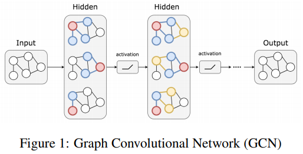

# GraphRel: Modeling Text as Relational Graphs for Joint Entity and Relation Extraction

## 整体介绍

### 类型

- 实体关系联合抽取

### 思想

- 关系加权的GCNs
  - 考虑实体关系间的互相作用

### 方法

- 线性核依赖结构 -> 提取文本的序列特征 和 区域特征
- 完整的词图 -> 提取文本所有词对间的隐含特征
- 基于图的方法 -> 有利于对重叠关系的预测

### 数据集

- NYT
- WebNLG

### 关键

- 想要自动提取特征的联合模型
  - 通过堆叠Bi-LSTM语句编码器和GCN (Kipf和Welling, 2017)依赖树编码器来自动学习特征
  - 用以考虑线性和依赖结构
    - 类似于Miwa和Bansal(2016)（一样是堆叠的）
      - 方法
        - 每个句子使用Bi-LSTM进行自动特征学习
        - 提取的隐藏特征由连续实体标记器和最短依赖路径关系分类器共享
      - 问题
        - 然而，在为联合实体识别和关系提取引入共享参数时：
          - 它们仍然必须将标记者预测的实体提及通过管道连接起来
          - 形成关系分类器的提及对

- 考虑重叠关系
- 如何考虑关系之间的相互作用
  - 2nd-phase relation-weighted GCN
  - 重叠关系(常见）
    - 情况
      - 两个三元组的实体对重合
      - 两个三元组都有某个实体mention
    - 推断
      - 困难（对联合模型尤其困难，因为连实体都还不知道）

### 本文工作

- 学习特征
  - 通过堆叠Bi-LSTM语句编码器和GCN (Kipf和Welling, 2017)依赖树编码器来自动学习特征
- 第一阶段的预测
  - GraphRel标记实体提及词，预测连接提及词的关系三元组
  - 用关系权重的边建立一个新的全连接图（中间图）
  - 指导：关系损失和实体损失
- 第二阶段的GCN
  - 通过对这个中间图的操作
  - 考虑实体之间的交互作用和可能重叠的关系
  - 对每条边进行最终分类
  - 在第二阶段，基于第一阶段预测的关系，我们为每个关系构建完整的关系图，并在每个图上应用GCN来整合每个关系的信息，进一步考虑实体与关系之间的相互作用。

### 本文贡献

- 该方法考虑了线性和依赖结构，以及文本中所有词对之间的隐含特征
- 对实体和关系进行端到端的联合建模，同时考虑所有的词对进行预测
- 仔细考虑实体和关系之间的交互

## NRE 中关键工作

- 实体识别和关系提取的端到端联合建模
- 预测重叠关系，即，共同提及的关系
- 考虑关系之间的相互作用，尤其是重叠关系

## 早期研究方法及所存在的问题

### 第一个问题：如何自动提取特征的联合关系？

1. pipeline 联合实体识别和关系提取模型
  
- 步骤
  - 首先使用指定的实体识别器提取实体提及；
  - 然后预测每对提取的实体提及之间的关系。
- 问题
  - 复杂的方法是基于特征的结构化学习系统，因此严重依赖于特征工程

2. 自动学习特征的神经网络方法（非联合模型）

- 步骤
  - 使用CNN、LSTM或Tree-LSTM对两个实体提及之间的单词序列进行处理；
  - 两个实体提及之间的最短依赖路径(Yan et al., 2015; Li et al., 2015),或the minimal constituency sub-tree spanning two entity mentions(Socher et al.， 2012)，为每对实体提及编码相关信息
- 问题
  - 该方法并不是实体和关系的端到端联合建模。他们假设实体提及是给定的，并期望在管道中需要一个命名实体识别器时显著降低性能

### 第二个问题：如何考虑关系间的相互关系？

- 情况
  - (BarackObama, PresidentOf, UnitedStates)可以从(BarackObama, Governance, UnitedStates)中推出;据说这两个三元组实体对重叠了；
  - 前三个词也可以从(巴拉克·奥巴马，LiveIn，白宫)和(白宫，总统官邸，美国)推断出来，后两个词有单一的重合之处；
- 推断
  - 困难（对联合模型尤其困难）

## 本文工作

1. 自动学习特征
   1. 通过堆叠Bi-LSTM语句编码器和GCN (Kipf和Welling, 2017)依赖树编码器来自动学习特征
2. 第一阶段的预测：
   1. GraphRel标记实体提及词，预测连接提及词的关系三元组
   2. 同时，用关系权重的边建立一个新的全连接图（中间图）
   3. 指导：关系损失和实体损失
3. 第二阶段的GCN
   1. 通过对这个中间图的操作
   2. 考虑实体之间的交互作用和可能重叠的关系
   3. 对每条边进行最终分类

## 本文方法介绍

### GCN 介绍

GCN 对相邻节点的特征进行卷积，并将一个节点的信息传播给最近的邻居。如图1所示，通过叠加GCN层，GCN可以提取每个节点的区域特征。GCN层通过考虑相邻节点的特征来获取新的节点特征：

### 本文框架介绍

- 第一阶段：
  - 利用 Bi-RNN 提取 序列特征；
  - 利用 GCN 提取 区域依赖词特征；
  - 利用上面信息，预测每个单词对的关系和所有单词的实体
-  第二阶段：
   - 基于 1st-phase 所预测得结果，为每一个关系建立完整关系图；
   - 在每个图上应用GCN来整合每个关系的信息；
   - 并进一步考虑实体与关系之间的相互作用

### 具体介绍

#### 第一阶段

##### Bi-LSTM

对于每个词，我们合并词向量和 POS 向量作为初始特征：

$$h_{u}^{0}=W \operatorname{ord}(u) \oplus P O S(u)$$

##### Bi-GCN

- 问题

由于原始输入句是一个序列，没有内在的图结构。

- 解决方法

1. 使用依赖解析器为输入句创建一个依赖树；
2. 使用依赖树作为输入句子的邻接矩阵；
3. 使用GCN提取区域依赖特征

- 公式

##### Extraction of Entities and Relations

- 输入：以上特征
- 损失函数： categorical loss ($eloss_{1p}$)
- 步骤
  - 预测词的实体
  - 提取每一对词的关系
    - 对于关系提取，删除了依赖边并对所有的词对进行预测；
    - 对于每个关系 r,学习权值矩阵 $W^{1}_{r},W^{2}_{r},W^{3}_{r}$，然后计算关系分数：

    

    - 计算概率

    

    - 利用Pr（w1，w2），计算出分类损失的关系，记为$rloss_{1p}$

#### 第二阶段

##### 目标

1. 考虑实体和关系间的相互依赖关系；
2. 考虑关系间的关系

##### Relation-weighted Graph

1. 建立对每一个关系r的关系权值图，其中边(w1,w2) 是 Pr(w1,w2)：

2. 每个关系图上采用bi-GCN，将不同关系的不同影响程度和汇总作为综合词特征
   

3. Bi-GCN 考虑关系权重的传递，并且从每个词中提取出更充足的特征

4. 利用来自第二阶段的较新单词特征，再次执行命名实体和关系分类，以进行更可靠的关系预测，此时对应的损失函数为 $eloss_{2p}$和$rloss_{2p}$

#### Training Detail

##### 实体识别

- 标注：BIESO
- 损失函数：交叉熵

##### 关系抽取

- 使用 one-hot 关系向量作为 每一对词对 的 关系；
- 损失函数：交叉熵
- 对于eloss和rloss，我们为类内的实体或关系项添加了额外的double-weighted：

#### inference

1. head prediction
- 实体对存在关系的前提：
  - 两个实体均被识别；
  - Pr(e1,e2) 最大；
- 平均预测
  - 一对实体提及对的所有词对的概率平均最大的关系
- threshold阈值预测
  - 独立地思考实体提及对的所有词对
  - 实体提及对中的所有词对中有θ以上占比认为此关系最有可能，则提取此关系

## 参考资料

1. [论文阅读课3-GraphRel: Modeling Text as Relational Graphs for(实体关系联合抽取，重叠关系，关系之间的关系，自动提取特征）](https://blog.csdn.net/weixin_40485502/article/details/104311665)
2. [《GraphRel: Modeling Text as Relational Graphs for Joint Entity and Relation Extraction》阅读记录](https://blog.csdn.net/qq_40931181/article/details/102709340)
3. [NLP论文阅读笔记（Ⅲ）](https://doublebelief.github.io/2019/12/31/NLPpaperNotes3/)