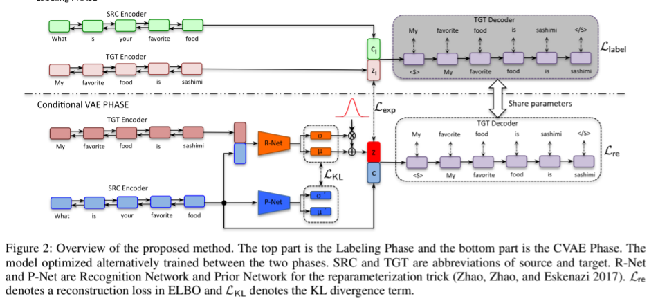

# 【关于 SLCVAE 】那些你不知道的事

> 作者：杨夕
> 
> 项目地址：https://github.com/km1994/nlp_paper_study
> 
> 个人介绍：大佬们好，我叫杨夕，该项目主要是本人在研读顶会论文和复现经典论文过程中，所见、所思、所想、所闻，可能存在一些理解错误，希望大佬们多多指正。
> 
> 论文名称：Improve Diverse Text Generation by Self Labeling Conditional Variational Auto Encoder
> 
> 论文地址：chrome-extension://ikhdkkncnoglghljlkmcimlnlhkeamad/pdf-viewer/web/viewer.html?file=https%3A%2F%2Farxiv.org%2Fpdf%2F1903.10842.pdf
> 
> 论文源码：https://github.com/zhangfangdeng/SLCVAE

## 目录

- [【关于 SLCVAE 】那些你不知道的事](#关于-slcvae-那些你不知道的事)
  - [目录](#目录)
  - [摘要](#摘要)
  - [前言知识](#前言知识)
    - [KL 散度 vanish 问题](#kl-散度-vanish-问题)
      - [出现原因](#出现原因)
      - [KL 散度 vanish 是什么](#kl-散度-vanish-是什么)
        - [KL-vanishing 问题解决方法](#kl-vanishing-问题解决方法)
    - [seq2seq：](#seq2seq)
    - [VAE and CVAE](#vae-and-cvae)
      - [Variational Auto Encoder](#variational-auto-encoder)
      - [CVAE](#cvae)
  - [论文方法](#论文方法)
    - [避免 KL vanishing problem 方法](#避免-kl-vanishing-problem-方法)
    - [基本思想](#基本思想)
  - [论文贡献](#论文贡献)
  - [实验](#实验)
    - [生成效果对比](#生成效果对比)
  - [参考](#参考)

## 摘要

多样性在许多文本生成应用程序中起着至关重。

近年来，条件变分自动编码器（CVAE）已经显示出用于该任务的有希望的性能。

然而，他们经常遇到所谓的**KL消失问题**。先前的工作通过**启发式方法减轻了这样的问题**，例如在优化CVAE目标函数的同时加强编码器或弱化解码器。然而，这些方法的**优化方向是隐含的**，很难找到应该应用这些方法的适当程度。

在本文中，我们提出了一个明确的优化目标，以补充CVAE，直接摆脱KL消失。实际上，该客观术语指导编码器朝向解码器的“最佳编码器”以增强表现力。引入标记网络来估计“最佳编码器”。它在CVAE的潜在空间中提供连续标签，以帮助在潜在变量和目标之间建立紧密联系。整个提出的方法被命名为Self Labeling CVAE~（SLCVAE）。为了加速不同文本生成的研究，我们还提出了一个大的本地一对多数据集。

对两项任务进行了大量实验，结果表明，与现有算法相比，我们的方法在很大程度上改善了生成多样性，同时实现了可比较的精度。我们还提出了一个大的本地一对多数据集。对两项任务进行了大量实验，结果表明，与现有算法相比，我们的方法在很大程度上改善了生成多样性，同时实现了可比较的精度。我们还提出了一个大的本地一对多数据集。对两项任务进行了大量实验，结果表明，与现有算法相比，我们的方法在很大程度上改善了生成多样性，同时实现了可比较的精度。

## 前言知识

### KL 散度 vanish 问题

#### 出现原因

- 出现原因：当VAE和强如RNN / PixelCNN这样的auto regressive models在一起训练时，会出现糟糕的“KL-vanishing problem”，或者说是“posterior collapse”。

#### KL 散度 vanish 是什么

- 在VAE里面，KL vanishing problem主要是指当KL(q(z|x) || p(z))消失时，并且当隐变量z和x独立时，此时的ELBO=log(p(x))：

但是如果z和x完全独立，这就意味着VAE的生成过程中，decoder完全不依赖z去生成x，从而退化成一个一般的language model。这并不是我们想要的结果。

通过对KL vanishing problem的分析，假设当KL(q(z|x) || p(z))=0时，存在着两种情况，一个是z与x独立， 另一个是z和x不独立。我们想得到的解是当KL(q(z|x) || p(z))=0时，z和x不独立。现在我们引入博弈论的思想，对于VAE的优化目标来说，一共有2×2四种情况：即z 与 x 是否独立，和q(z | x) 与 p(z) 是否相等。

我们想要的，应该是第三种情况，即z 与 x 不独立，且q(z | x) 与 p(z) 是相等的。

##### KL-vanishing 问题解决方法

- 第一，对于KL，我们需要为latent variable寻找更为flexible的prior和posterior，不仅仅是因为优化mean- field Gaussian distribution的KL显得过于容易，而且真实情况下的posterior也不可能只是个Gaussian distribution。
- 第二，对于reconstruction项，我们需要一个不那么强大的decoder，让decoder也去依赖z，不要一个人把事情做了。

### seq2seq：

- 思路：
  - encoder：从输入中提取语义表示；
  - decoder：根据语义表示生成与 input 相关的句子
- 问题：
  - SEQ2SEQ往往以枯燥而笼统的回应告终。这种情况经常发生在会话系统中，因为诸如“我不知道”或“我很好”这样安全而无意义的响应经常出现，然后被解码器捕获。
  - 无法满足多样性。对多个可能输出的拟合能力不足，对于代表向量，用于产生输出的解码器是固定的，只依赖于输入。这些问题不仅降低了文本生成的精度，而且限制了文本生成的多样性 【eg：对话系统】
- 领域：
  - 开放域对话系统：给定对话历史记录，可能存在语法上正确且语义上有意义的各种响应。 对话机器人应该能够为训练中的相同输入建模这些多个响应，并在预测中给出像人类一样的多种答案。
  - 电子商务推荐系统：对于给定的项目，个性化推荐需要多个卖点和说明。 图1显示了一个示例。 通过大量的推荐文本，可以选择不同的句子以显示给不同的用户，以满足他们的喜好，或者在各种情况下显示给同一用户，这样他/她就不会感到单调。
- 原因：“一个源，多个目标”问题。由于**传统的编解码模型将相同的输入模式编码到相同的唯一代表向量中而不发生任何变化**，因此它们从一个输入生成不同句子的能力受到限制。
- 改进方法：
  - MMI-antiLM算法：
      - 方法：在无条件的高频响应中加入了语言模型惩罚。
      - 优点：成功地解决了一般性的、反应迟钝的问题
      - 缺点：不适用于处理多目标，因为它只考虑一个目标。解码过程中n个最佳输出的波束搜索（BS）方法是机器翻译中常用的方法，可用于文本生成。然而，在同一个词源中，贪婪策略仍然倾向于生成类似的句子。
  - 强化学习
      - 方法：修改BS中使用的策略，使其符合反向行为目标
      - 缺点：可能会降低输出以上方法是基于编解码模型推理阶段的改进策略。但是编码器-译码器模型本身并没有实质性地变得更重要。它们的战略实际上是多样性和连贯性之间的权衡，因此受到限制。

### VAE and CVAE

#### Variational Auto Encoder

- 介绍：

It makes use of a latent variable z sampled from a prior distribution to generate data x. The logarithm likelihood of the data x is optimized by maximizing the evidence lower bound (ELBO):(它利用从先验分布中采样的潜在变量z生成数据x。 通过最大化证据下界（ELBO）来优化数据x的对数似然)

> while both q(z|x) and p(z|x) are parameterized as encoder qφ(z|x) and decoder pθ(z|x). It is obvious that VAE encodes the input x into a probability distribution rather than a fixed vector so that different z could be chosen from the distribution to obtain different outputs x.

#### CVAE

- 改进编码解码器模型：
  - 方法：用一些方法来干扰一个训练有素的编解码器模型的推理阶段，以获得丰富的输出；
  - 缺点：编码结果和解码结果之间的误差是有限的；
- 可变编解码器：
  - 方法：引入了一个中间潜在变量，并假设潜在变量cor的每个配置都响应一个可行的响应。因此，通过对变量进行采样，可以产生不同的响应。
  - 问题：VAE 和 CVAE 都遇到了KL消失的问题，即解码器往往不利用潜在变量来建模目标

## 论文方法

### 避免 KL vanishing problem 方法

- 避免 KL vanishing problem：引入新的损失函数

### 基本思想

通过使隐变量z包含x的信息，从而避免模型收敛到(z与x独立，q(z|x) == p(z))这个解。具体来说，他们构建了一个label network，用来输出 $z_{label}$ ，他是decoder输出x的一个逆向的估计（即，通过 $z_{label}$ ，对于当前的decoder理应输出相对应的x）。

## 论文贡献

- 首先，我们指出，由于缺乏对潜在变量和目标之间联系的明确约束，目前的CVAE目标函数倾向于解决KL消失问题。
- 其次，我们提出了一种新的显式优化目标将译码器与潜在变量连接起来的自标记机制。在这个目标下，编码器同时被拉向由当前解码器和先验分布定义的“最佳编码器”，从而使编码器分布接近先验，同时保持表现力的平衡。因此，KL消失问题是有意义的。
- 此外，大量的实验表明，我们的SLCVAE方法具有更好的多目标建模能力，并且在不损失准确性的情况下提高了文本生成的多样性。第三，构建了一个大规模的数据集degoods，该数据集包含了高质量的一对多文本数据，加快了对文本生成的研究

## 实验

### 生成效果对比

## 参考

1. [通过自标记条件变分自动编码器，提高文本生成的多样性](https://zhuanlan.zhihu.com/p/60609670)
2. [文本生成9：VAE中KL vanishing 问题的一般解](https://zhuanlan.zhihu.com/p/98797312)
3. [KL 散度 vanish](https://zhuanlan.zhihu.com/p/64071467)