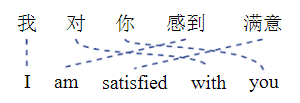
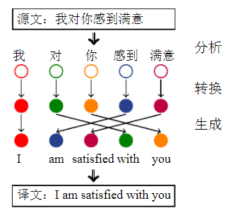

# 【关于 机器翻译】 那些你不知道的事

> 作者：杨夕
> 
> 项目地址：https://github.com/km1994/nlp_paper_study
> 
> 个人介绍：大佬们好，我叫杨夕，该项目主要是本人在研读顶会论文和复现经典论文过程中，所见、所思、所想、所闻，可能存在一些理解错误，希望大佬们多多指正。
> 
> NLP 面经地址：https://github.com/km1994/NLP-Interview-Notes

## 一、什么是机器翻译？

源语言到目标语言的映射

## 二、基于词的机器翻译篇

### 2.1 什么是 基于词的机器翻译？

在翻译一个句子时，可以把其中的每个单词翻译成对应的目标语言单词，然后调整这些目标语言单词的顺序，最后得到整个句子的翻译结果，而这个过程可以用统计模型来描述。

> 汉语到英语的翻译实例及两种语言单词之间的对应关系

1. 首先，可以把源语言句子中的单词“我”、“对”、“你”、“感到”和“满意”分别翻译为“I”、“with”、“you”、“am”和“satisfied”;
2. 然后调整单词的顺序，比如，“am”放在译文的第 2 个位置，“you”应该放在最后的位置等等;
3. 最后得到译文“I am satisfied with you”。

### 2.2 基于词的机器翻译存在问题？

- 流畅度问题：源语言和目标语言中词的顺序不一致问题；
- 准确性问题：源语言中的单词可能存在多种翻译问题；

### 2.3 基于词的机器翻译如何解决上面问题的思路？

解决上面问题，需要采用以下步骤：

1. 分析：将源语言句子表示为适合机器翻译的结构。在基于词的翻译模型中，处理单元是单词，因此在这里也可以简单地将分析理解为分词；
2. 转换：把源语言句子中的每个单词翻译成目标语言单词；
3. 生成：基于转换的结果，将目标语译文变成通顺且合乎语法的句子。

> 翻译过程中的分析、转换和生成

