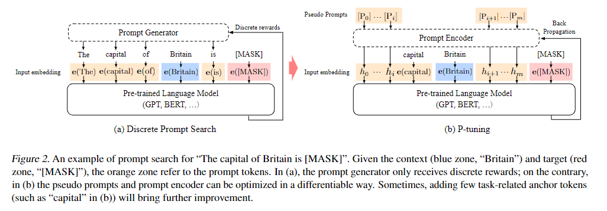

# 【关于 Prompt Tuning】 那些你不知道的事

> 作者：杨夕
> 
> NLP论文学习笔记：https://github.com/km1994/nlp_paper_study
> 
> **[手机版NLP论文学习笔记](https://mp.weixin.qq.com/s?__biz=MzAxMTU5Njg4NQ==&mid=100005719&idx=1&sn=14d34d70a7e7cbf9700f804cca5be2d0&chksm=1bbff26d2cc87b7b9d2ed12c8d280cd737e270cd82c8850f7ca2ee44ec8883873ff5e9904e7e&scene=18#wechat_redirect)**
> 
> 个人介绍：大佬们好，我叫杨夕，该项目主要是本人在研读顶会论文和复现经典论文过程中，所见、所思、所想、所闻，可能存在一些理解错误，希望大佬们多多指正。
> 
> NLP 百面百搭 地址：https://github.com/km1994/NLP-Interview-Notes
> 
> **[手机版NLP百面百搭](https://mp.weixin.qq.com/s?__biz=MzAxMTU5Njg4NQ==&mid=100005719&idx=3&sn=5d8e62993e5ecd4582703684c0d12e44&chksm=1bbff26d2cc87b7bf2504a8a4cafc60919d722b6e9acbcee81a626924d80f53a49301df9bd97&scene=18#wechat_redirect)**
> 
> 推荐系统 百面百搭 地址：https://github.com/km1994/RES-Interview-Notes
> 
> **[手机版推荐系统百面百搭](https://mp.weixin.qq.com/s/b_KBT6rUw09cLGRHV_EUtw)**

## 一、Prompt Tuning 发展路线

### 1.1 技术发展路线

- 特征工程阶段
  - 依赖大量人工
  - 需要监督数据
- 架构工程阶段
  - 人工构建特征的工作量减少
  - 设计各异的神经网络结构从而拿到结果需要监督数据
- 预训练-微调阶段
  - 预训练可以不需要监督数据

### 1.2 工业界 vs 学术界

- 工业界:更适合工业界的少数据场景，减少一部分标注成本
  - 工业界对于少数据场景，往往(也有用半监督学习) 先rule-based走通业务逻辑，在线上线下标注数据，再进一步监督学习或微调。
  - 目前工业界里还难打的过微调
  - 定位:可以探索
- 学术界:适合学术研究
  - 新任务+PL，效果不要太差，都是一次新的尝试与探索
  - 定位:做研究

## 二、Prompt Tuning 工作流程介绍

### 2.1 文本代入 Template

- 介绍：模板Template 构造，文本代入 Template
- 思路：
  - step 1: 构建模板：[x] overall,it was a[z] movie.
  - step 2: 构建文本：l love this movie.
  - step 3: 文本代入 Template: l love this movie. overall, it was a [z] movie

### 2.2 映射 Verbalizer 构造

- 介绍：建立预测词-标签的映射关系
- eg:

```s
    fantastic、great、amazing -> positive
    boring、bad -> negative
```

### 2.3 Prediction预测

- 介绍：根据 Verbalizer ，使用预训练模型对 2.1 代后的文本进行预测
- eg:
  - I love this movie.overallit was a **fantastic** movie

### 2.4 Mapping映射

- 介绍：预测结果代入Verbalizer，得到映射后的结果
- eg：

```s
    fantastic -> positive
```

## 三、Prompt Tuning 研究方向介绍

### 3.1 Template 设计研究

> eg: I love this movie. overall, it was a [z] movie

#### 3.1.1 Template 形状研究

1. cloze prompt
   1. 介绍：[z] 在句中，适合使用了Mask任务的LM
2. prefix prompt
   1. 介绍：[z] 在句末，适合生成LM、自回归LM （自编码LM（Bert） vs 自回归LM（GPT））
3. 文本匹配任务，Prompt可以有两个[X]

#### 3.1.2 Template 设计研究

1. 手工设计

- 介绍：人工 手工设计 Template
- 优点：直观
- 缺点：成本高，需要实验、经验等

2. 自动学习 模Template板

- 介绍：通过模型学习上下文，自动生成 Template
- 离散Prompt
  - 介绍：自动生成自然语言词
  - eg: 给定一个大的文本库，给定输入x和输出y，在文本库中离散地搜索出现频繁的中间词或连词等，从而得到一个模板。
- 连续Prompt
  - 介绍：Template的设计不必拘泥于自然语言，直接变成embedding表示也是可以的，设置独立于LM的模板参数，可以根据下游任务进行微调
  - eg：给定一个可训练的参数矩阵，将该参数矩阵与输入文本进行连接，从而丢入模型进行训练。

### 3.2 Verbalizer 设计研究 (Answer Engineering)

- 介绍：寻找合适的答案空间Z，以及答案与标签的映射
- eg：Knowledgeable Prompt-tuning:Incorporating Knowledge intoPrompt Verbalizer for Text Classification (KPT)
  - 用KB去查询Label相关词作为候选集，然后去噪


### 3.3 训练策略(Prompt-based Training Strategies)

- Tuning-free Prompting
  - 直接做zero-shot
- Fixed-LM Prompt Tuning
  - 引入额外与Prompt相关的参数，固定LM参数，微调与Prompt相关参数
- Fixed-prompt LM Tuning
  - 引入额外与Prompt相关的参数，固定与Prompt相关参数，微调LM
- Prompt + LM Tuning
  - 引入额外与Prompt相关的参数，两者都微调

## 四、prompt进阶——自动学习prompt

### 4.1 动机

手工设计prompt（基于token的prompt）还有一个问题是，**模型对prompt很敏感，不同的模板得到的效果差别很大**。


> 注：prompt一字之差效果也会差别很大 (来自文献[2])

所以研究学者就提出自动学习prompt向量的方法。因为我们输入进去的是人类能看懂的自然语言，那在机器眼里是啥，啥也不是， 也不能这么说吧，prompt经过网络后还是得到一个个向量嘛，既然是向量，当然可以用模型来学习了，甚至你输入一些特殊符号都行，模型似乎无所不能，什么都能学，只要你敢想，至于学得怎么样，学到了什么，还需进一步探究。

### 4.2 P-tuning——token+vector组合成prompt [论文](https://arxiv.org/abs/2103.10385) [github](https://github.com/THUDM/P-tuning)

- 动机：手工设计prompt（基于token的prompt）存在问题，那么是否可以引入（基于vector的prompt），所以就有了 基于 token+vector 的 prompt
- 具体说明（如下图）：
  - 任务：模型来预测一个国家的首都
  - 左边是全token的prompt，文献里称为“离散的prompt”，有的同学一听"离散"就感觉懵了，其实就是一个一个token组成的prompt就叫“离散的prompt”。
  - 右边是token+vector形式的prompt，其实是保留了原token prompt里面的关键信息(capital, Britain)，(capital, Britain)是和任务、输出结果最相关的信息，其他不关键的词汇(the, of ,is)留给模型来学习。

- token形式的prompt: “The captital of Britain is [MASK]”
- token+vector: “h_0 , h_1, ... h_i, captital, Britain, h_(i+1), ..., h_m [MASK]”



### 4.3 P-tuning v2——全vector prompt [论文](https://arxiv.org/pdf/2110.07602.pdf) [github](https://github.com/THUDM/P-tuning-v2)

- 思路：全vecotor可以直接拼接在预训练模型的layer里面，而且这个模型可以做序列tagging任务(给输入序列中每个token打标签)


### 4.4 PPT——预训练prompt [论文](https://arxiv.org/pdf/2109.04332.pdf) [github](https://github.com/THUDM/P-tuning-v2)

- 动机：以上Prompt采用vector形式之后，在训练集比较大(full-data)的时候效果是好的，但是在few-shot(训练集很小)场景下就不好了，因为数据量小不好学嘛。那怎么办呢？既然NLP任务都有预训练模型，那么prompt是否也可以先进行预训练再微调呢？
- 思路：拿大量无标签语料对Prompt先做个预训练，再在下游任务上做微调


## 五、prompt 总结

1. prompt设计：可以手动设计模板，也可以自动学习prompt，这里可填坑的地方比较多；
2. 预训练模型的选择：选择跟任务贴近的预训练模型即可；
3. 预测结果到label的映射：如何设计映射函数，这里可填坑的地方也比较多
4. 训练策略：根据prompt是否有参数，预训练模型参数要不要调，可以组合出各种训练模式，根据标注数据样本量，选择zero-shot, few-shot还是full-data。比如few-shot场景，训练数据不多，如果prompt有参数，可以固定住预训练模型的参数，只调prompt的参数，毕竟prompt参数量少嘛，可以避免过拟合。

## 六、prompt-tuning 代码学习

### 6.1 prompt-tuning 学习代码

- [OpenPrompt](https://github.com/thunlp/OpenPrompt)
  - 由清华推出了prompt-tuning工具包
  - 特点：每个 class 都继承了 torch 的类或者 huggingface 的类，可以方便地部署自己的任务


- [Prompt在中文分类few-shot场景中的尝试](https://zhuanlan.zhihu.com/p/424888379)
  - 特点：包含数据集构建、模板构建、训练测试一套完整代码

### 6.2 prompt-tuning 实战 

#### 6.2.1 定义任务

根据你的任务和数据来定义classes 和 InputExample。

以情感分类任务为例，classes包含2个label："negative"和"positive"

```s
  from openprompt.data_utils import InputExample
  classes = [ # There are two classes in Sentiment Analysis, one for negative and one for positive
      "negative",
      "positive"
  ]
  dataset = [ # For simplicity, there's only two examples
      # text_a is the input text of the data, some other datasets may have multiple input sentences in one example.
      InputExample(
          guid = 0,
          text_a = "Albert Einstein was one of the greatest intellects of his time.",
      ),
      InputExample(
          guid = 1,
          text_a = "The film was badly made.",
      ),
  ]
```

#### 6.2.2 定义预训练语言模型

根据具体任务选择合适的预训练语言模型，这里采用的预训练模型是bert，因为根据prompt的设计，是想让模型输出[mask]位置的词语，属于填空问题。

```s
  from openprompt.plms import load_plm
  plm, tokenizer, model_config, WrapperClass = load_plm("bert", "bert-base-cased")
```

#### 6.2.3 定义prompt模板

这个例子是手动设计模板，模板放在ManualTemplate里面，text = '{"placeholder":"texta"} It was {"mask"}', 其中text_a就是InputExample里面的输入text_a，It was {"mask"} 就是prompt。

```s
  from openprompt.prompts import ManualTemplate
  promptTemplate = ManualTemplate(
      text = '{"placeholder":"text_a"} It was {"mask"}',
      tokenizer = tokenizer,
  )
```

#### 6.2.4 定义输出-label映射

在情感分类里面，[Mask]位置的输出是一个单词，我们要把这些单词映射成"positive","negative"标签，这个过程称为"Verbalizer"，比如"bad"属于"negative"， "good", "wonderful", "great"属于"positive"。

```s
  from openprompt.prompts import ManualVerbalizer
  promptVerbalizer = ManualVerbalizer(
      classes = classes,
      label_words = {
          "negative": ["bad"],
          "positive": ["good", "wonderful", "great"],
      },
      tokenizer = tokenizer,
  )
```

#### 6.2.5 组合构建为PromptModel类

将前面几步构建的模板(promptTemplate)、预训练模型(plm)、输出映射(promptVerbalizer)组成promptModel

```s
  from openprompt import PromptForClassification
  promptModel = PromptForClassification(
      template = promptTemplate,
      plm = plm,
      verbalizer = promptVerbalizer,
  )
```

#### 6.2.6 组定义dataloader

将前面几步构建的模板(promptTemplate)、预训练模型(plm)、输出映射(promptVerbalizer)组成promptModel

```s
from openprompt import PromptDataLoader
data_loader = PromptDataLoader(
        dataset = dataset,
        tokenizer = tokenizer, 
        template = promptTemplate, 
        tokenizer_wrapper_class=WrapperClass,
    )
```

#### 6.2.7 开始训练、测试

```s
 # making zero-shot inference using pretrained MLM with prompt
 promptModel.eval()
 with torch.no_grad():
 for batch in data_loader:
        logits = promptModel(batch)
        preds = torch.argmax(logits, dim = -1)
        print(classes[preds])
        # predictions would be 1, 0 for classes 'positive', 'negative'
```


## 参考资料

- [Prompt Learning全面梳理扫盲](https://zhuanlan.zhihu.com/p/493900047)
- [一文轻松入门Prompt(附代码)](https://zhuanlan.zhihu.com/p/440169921)
- [prompt工程指南](https://github.com/dair-ai/Prompt-Engineering-Guide)
- [[细读经典]P-tuning：用“连续提示微调”来增强“超大规模语言模型”的下游能力](https://zhuanlan.zhihu.com/p/391992466)
- [NLPer福利！清华推出Prompt-tuning开源工具包，取代传统的微调fine-tuning](https://zhuanlan.zhihu.com/p/415944918)
- [一文跟进Prompt进展！综述+15篇最新论文逐一梳理](https://blog.csdn.net/qq_27590277/article/details/121173627)
- [Prompt在低资源NER中的应用](https://zhuanlan.zhihu.com/p/428225612)
- [Pre-train, Prompt, and Predict: A Systematic Survey of Prompting Methods in Natural Language Processing](https://arxiv.org/abs/2107.13586)
- [GPT Understands, Too](https://arxiv.org/pdf/2103.10385.pdf)
- [P-Tuning v2: Prompt Tuning Can Be Comparable to Fine-tuning Universally Across Scales and Tasks](https://arxiv.org/abs/2110.07602)
- [PPT: Pre-trained Prompt Tuning for Few-shot Learning](https://arxiv.org/pdf/2109.04332.pdf)
- [Fine-tune之后的NLP新范式：Prompt越来越火，CMU华人博士后出了篇综述文章](https://zhuanlan.zhihu.com/p/395795968)
