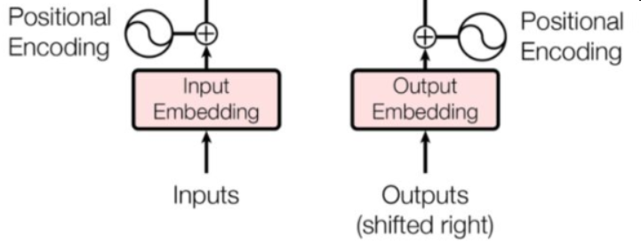
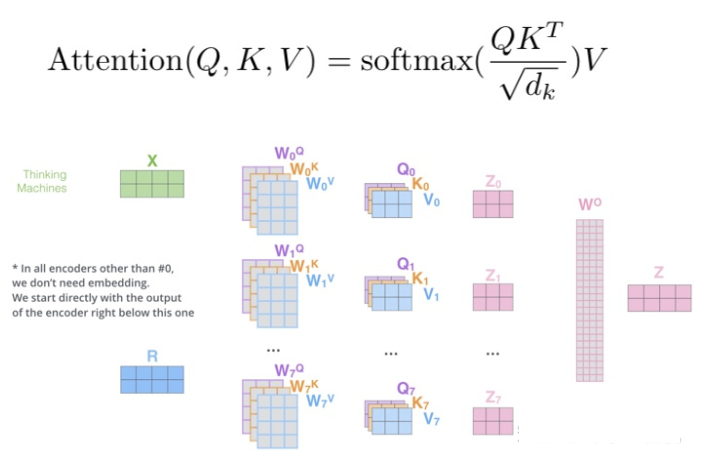
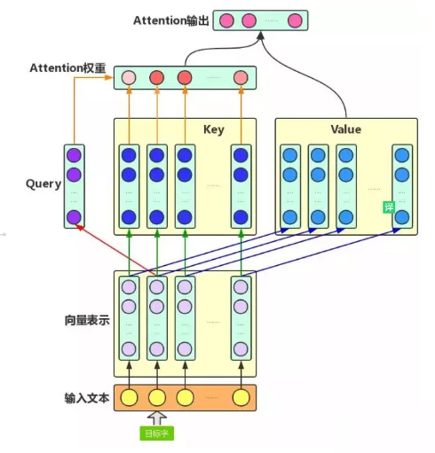
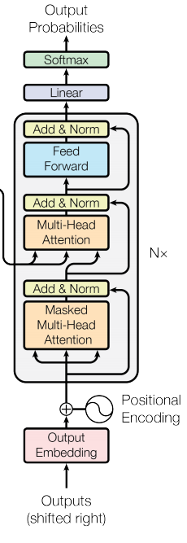

# 【关于 Transformer 代码实战（文本摘要任务篇）】 那些你不知道的事

> 作者：杨夕
> 
> 项目地址：https://github.com/km1994/nlp_paper_study
> 
> 个人介绍：大佬们好，我叫杨夕，该项目主要是本人在研读顶会论文和复现经典论文过程中，所见、所思、所想、所闻，可能存在一些理解错误，希望大佬们多多指正。

## 目录

- [【关于 Transformer 代码实战（文本摘要任务篇）】 那些你不知道的事](#关于-transformer-代码实战文本摘要任务篇-那些你不知道的事)
  - [目录](#目录)
  - [引言](#引言)
  - [一、文本摘要数据集介绍](#一文本摘要数据集介绍)
  - [二、数据集加载介绍](#二数据集加载介绍)
    - [2.1 数据加载](#21-数据加载)
    - [2.2 数据字段抽取](#22-数据字段抽取)
  - [三、 数据预处理](#三-数据预处理)
    - [3.1 summary 数据 处理](#31-summary-数据-处理)
    - [3.2 编码处理](#32-编码处理)
    - [3.3 获取 encoder 词典 和 decoder 词典 长度](#33-获取-encoder-词典-和-decoder-词典-长度)
    - [3.4 确定 encoder 和 decoder 的 maxlen](#34-确定-encoder-和-decoder-的-maxlen)
    - [3.5 序列 填充/裁剪](#35-序列-填充裁剪)
  - [四、创建数据集 pipeline](#四创建数据集-pipeline)
  - [五、组件构建](#五组件构建)
    - [5.1 位置编码](#51-位置编码)
      - [5.1.1 问题](#511-问题)
      - [5.1.2 目的](#512-目的)
      - [5.1.3 思路](#513-思路)
      - [5.1.4 位置向量的作用](#514-位置向量的作用)
      - [5.1.5 步骤](#515-步骤)
      - [5.1.6 计算公式](#516-计算公式)
      - [5.1.7 代码实现](#517-代码实现)
    - [5.2 Masking 操作](#52-masking-操作)
      - [5.2.1 介绍](#521-介绍)
      - [5.2.3 类别：padding mask and sequence mask](#523-类别padding-mask-and-sequence-mask)
        - [padding mask](#padding-mask)
        - [sequence mask](#sequence-mask)
  - [六、模型构建](#六模型构建)
    - [6.1 self-attention](#61-self-attention)
      - [6.1.1 动机](#611-动机)
      - [6.1.2 传统 Attention](#612-传统-attention)
      - [6.1.3 核心思想](#613-核心思想)
      - [6.1.4 目的](#614-目的)
      - [6.1.5 公式](#615-公式)
      - [6.1.6 步骤](#616-步骤)
      - [6.1.7 代码实现](#617-代码实现)
    - [6.2  Multi-Headed Attention](#62--multi-headed-attention)
      - [思路](#思路)
      - [步骤](#步骤)
      - [代码实现](#代码实现)
    - [6.3 前馈网络](#63-前馈网络)
      - [思路](#思路-1)
      - [目的](#目的)
      - [代码实现](#代码实现-1)
    - [6.4 Transformer encoder 单元](#64-transformer-encoder-单元)
      - [结构](#结构)
      - [代码实现](#代码实现-2)
    - [6.5 Transformer decoder 单元](#65-transformer-decoder-单元)
      - [结构](#结构-1)
      - [代码实现](#代码实现-3)
  - [七、Encoder 和 Decoder 模块构建](#七encoder-和-decoder-模块构建)
    - [7.1 Encoder 模块构建](#71-encoder-模块构建)
    - [7.2 Dncoder 模块构建](#72-dncoder-模块构建)
  - [八、Transformer 构建](#八transformer-构建)
  - [九、模型训练](#九模型训练)
    - [9.1 配置类](#91-配置类)
    - [9.2 优化函数定义](#92-优化函数定义)
    - [9.3  Loss 损失函数 和 评测指标 定义](#93--loss-损失函数-和-评测指标-定义)
      - [9.3.1  Loss 损失函数 定义](#931--loss-损失函数-定义)
    - [9.4 Transformer 实例化](#94-transformer-实例化)
    - [9.5 Mask 实现](#95-mask-实现)
    - [9.6 模型结果保存](#96-模型结果保存)
    - [9.7 Training Steps](#97-training-steps)
    - [9.8 训练](#98-训练)

## 引言

之前给 小伙伴们 写过 一篇 【[【关于Transformer】 那些的你不知道的事](https://github.com/km1994/nlp_paper_study/tree/master/transformer_study/Transformer)】后，有一些小伙伴联系我，并和我请教了蛮多细节性问题，针对该问题，小菜鸡的我 也 想和小伙伴 一起 学习，所以就 找到了 一篇【[Transformer 在文本摘要任务 上的应用](https://github.com/rojagtap/abstractive_summarizer)】作为本次学习的 Coding！

## 一、文本摘要数据集介绍

本任务采用的 文本摘要数据集 为 [ Kaggle 比赛 之 Inshorts Dataset](https://www.kaggle.com/shashichander009/inshorts-news-data)，该数据集 包含以下字段：

<table>
    <tr>
        <td>序号</td><td>字段名</td><td>字段介绍 </td><td>举例</td>
    </tr>
    <tr>
        <td>1</td><td>Headline</td><td>标题 </td><td>4 ex-bank officials booked for cheating bank of ₹209 crore</td>
    </tr>
    <tr>
        <td>2</td><td>Short</td><td>短文 </td><td>The CBI on Saturday booked four former officials of Syndicate Bank and six others for cheating, forgery, criminal conspiracy and causing ₹209 crore loss to the state-run bank. The accused had availed home loans and credit from Syndicate Bank on the basis of forged and fabricated documents. These funds were fraudulently transferred to the companies owned by the accused persons.</td>
    </tr>
    <tr>
        <td>3</td><td>Source</td><td>数据来源 </td><td>The New Indian Express </td>
    </tr>
    <tr>
        <td>4</td><td>Time</td><td>发表时间 </td><td>9:25:00</td>
    </tr>
    <tr>
        <td>5</td><td>Publish Date</td><td>发表日期 </td><td>2017/3/26 </td>
    </tr>
</table>

> 注：这里我们只 用到 Headline[摘要] 和 Short[长文本] 作为 文本摘要任务 实验数据

## 二、数据集加载介绍

### 2.1 数据加载

本文将数据集存储在 Excel 文件中，通过 pandas 的 read_excel() 方法 获取数据集，代码如下：

```s
    news = pd.read_excel("data/news.xlsx")
```

### 2.2 数据字段抽取

在 [一、文本摘要数据集介绍](#一文本摘要数据集介绍) 中，我们说过，我们只用到 Headline[摘要] 和 Short[长文本] 作为 文本摘要任务 实验数据，所以我们需要 清除 其他字段。代码如下：

```s
    news.drop(['Source ', 'Time ', 'Publish Date'], axis=1, inplace=True)
```

可以采用以下命令，查看结果：

```s
    news.head()
    news.shape   # (55104, 2)
```


方便后期操作，我们这里直接 从 DataFrame 中分别抽取 出 Headline[摘要] 和 Short[长文本] 数据：

```s
    document = news['Short']
    summary = news['Headline']
    document[30], summary[30]
    >>>
    ('According to the Guinness World Records, the most generations alive in a single family have been seven.  The difference between the oldest and the youngest person in the family was about 109 years, when Augusta Bunge&#39;s great-great-great-great grandson was born on January 21, 1989. The family belonged to the United States of America.',
    'The most generations alive in a single family have been 7')
```

## 三、 数据预处理

### 3.1 summary 数据 处理

summary 数据 作为 decoder 序列数据，我们需要做一些小处理【前后分别加一个标识符】，如下所示：

```s
    # for decoder sequence
    summary = summary.apply(lambda x: '<go> ' + x + ' <stop>')
    summary[0]
    >>>
    '<go> 4 ex-bank officials booked for cheating bank of ₹209 crore <stop>'
```

### 3.2 编码处理

在 进行 文本摘要任务 之前，我们需要 将 文本进行编码：

1. 变量定义
```s
    # since < and > from default tokens cannot be removed
    filters = '!"#$%&()*+,-./:;=?@[\\]^_`{|}~\t\n'    # 文本中特殊符号清洗 
    oov_token = '<unk>'                               # 未登录词 表示
```
2. 定义 文本预处理  tf.keras.preprocessing.text.Tokenizer() 编码类【用于后期 文本编码处理】
```s
    document_tokenizer = tf.keras.preprocessing.text.Tokenizer(oov_token=oov_token) 
    summary_tokenizer = tf.keras.preprocessing.text.Tokenizer(filters=filters, oov_token=oov_token)
```
> Tokenizer : 一个将文本向量化，转换成序列的类。用来文本处理的分词、嵌入 。
```s
    keras.preprocessing.text.Tokenizer(num_words=None, 
                                    filters='!"#$%&()*+,-./:;<=>?@[\\]^_`{|}~\t\n', 
                                    lower=True, 
                                    split=' ', 
                                    char_level=False, 
                                    oov_token=None, 
                                    document_count=0)
```
- 参数说明：
  - num_words: 默认是None处理所有字词，但是如果设置成一个整数，那么最后返回的是最常见的、出现频率最高的num_words个字词。一共保留 num_words-1 个词。
  - filters: 过滤一些特殊字符，默认上文的写法就可以了。
  - lower: 是否全部转为小写。
  - split: 分词的分隔符字符串，默认为空格。因为英文分词分隔符就是空格。
  - char_level: 分字。
  - oov_token: if given, it will be added to word_index and used to replace out-of-vocabulary words during text_to_sequence calls
> 参考文档：[Keras分词器 Tokenizer](http://codewithzhangyi.com/2019/04/23/keras-tokenizer/)
3. 构建词典库
```s
    # 构建词典库
    document_tokenizer.fit_on_texts(document)
    summary_tokenizer.fit_on_texts(summary)
```
4. 文本列表 转 序列的列表 【列表中每个序列对应于一段输入文本】
```s
    # 文本列表 转 序列的列表 【列表中每个序列对应于一段输入文本】
    inputs = document_tokenizer.texts_to_sequences(document)
    targets = summary_tokenizer.texts_to_sequences(summary)
    # 举例测试
    summary_tokenizer.texts_to_sequences(["This is a test"])         # [[184, 22, 12, 71]]
    summary_tokenizer.sequences_to_texts([[184, 22, 12, 71]])        # ['this is a test']
```

### 3.3 获取 encoder 词典 和 decoder 词典 长度
```s
    encoder_vocab_size = len(document_tokenizer.word_index) + 1
    decoder_vocab_size = len(summary_tokenizer.word_index) + 1
    # vocab_size
    encoder_vocab_size, decoder_vocab_size
    >>>
    (76362, 29661)
```

### 3.4 确定 encoder 和 decoder 的 maxlen

1. 分别进行 documents 和 summarys 中每个 序列长度

```s
    document_lengths = pd.Series([len(x) for x in document])
    summary_lengths = pd.Series([len(x) for x in summary])
```
2. 对 document_lengths 和 summary_lengths 进行 统计分析

- 对 document 进行 统计分析
```s
    document_lengths.describe()
    >>>
    count    55104.000000
    mean       368.003049
    std         26.235510
    min        280.000000
    25%        350.000000
    50%        369.000000
    75%        387.000000
    max        469.000000
    dtype: float64
```
- 对 summary 进行 统计分析
```s
    summary_lengths.describe()
    >>>
    count    55104.000000
    mean        63.620282
    std          7.267463
    min         20.000000
    25%         59.000000
    50%         63.000000
    75%         69.000000
    max         96.000000
    dtype: float64
```
3. 确定 encoder 和 decoder 的 maxlen
```s
    # 取值>并同时四舍五入到第75个百分位数，而不会留下高方差
    encoder_maxlen = 400
    decoder_maxlen = 75
```

### 3.5 序列 填充/裁剪 
```s
    #  对 序列 进行 填充/裁剪 ，是所有序列长度 都 等于 maxlen
    inputs = tf.keras.preprocessing.sequence.pad_sequences(inputs, maxlen=encoder_maxlen, padding='post', truncating='post')
    targets = tf.keras.preprocessing.sequence.pad_sequences(targets, maxlen=decoder_maxlen, padding='post', truncating='post')
```

## 四、创建数据集 pipeline

对数据集的顺序进行打乱，并 进行分 batch

```s
    # 数据类型 转为 为 tf.int32
    inputs = tf.cast(inputs, dtype=tf.int32)
    targets = tf.cast(targets, dtype=tf.int32)

    BUFFER_SIZE = 20000
    BATCH_SIZE = 64

    dataset = tf.data.Dataset.from_tensor_slices((inputs, targets)).shuffle(BUFFER_SIZE).batch(BATCH_SIZE)
```

## 五、组件构建

### 5.1 位置编码

#### 5.1.1 问题

- 介绍：缺乏 一种 表示 输入序列中 单词顺序 的方法
- 说明：因为模型不包括Recurrence/Convolution，因此是无法捕捉到序列顺序信息的，例如将K、V按行进行打乱，那么Attention之后的结果是一样的。但是序列信息非常重要，代表着全局的结构，因此必须将序列的分词相对或者绝对position信息利用起来
  
#### 5.1.2 目的

加入词序信息，使 Attention 能够分辨出不同位置的词

#### 5.1.3 思路

在 encoder 层和 decoder 层的输入添加了一个额外的向量Positional Encoding，维度和embedding的维度一样，让模型学习到这个值

#### 5.1.4 位置向量的作用

- 决定当前词的位置；
- 计算在一个句子中不同的词之间的距离

#### 5.1.5 步骤
- 将每个位置编号，
- 然后每个编号对应一个向量，
- 通过将位置向量和词向量相加，就给每个词都引入了一定的位置信息。

#### 5.1.6 计算公式



- 论文的位置编码是使用三角函数去计算的。好处：
  - 值域只有[-1,1]
  - 容易计算相对位置。


> 注：<br/>
> pos 表示当前词在句子中的位置<br/>
> i 表示向量中每个值 的 index<br/>
> 在偶数位置：使用 正弦编码 sin();<br/>
> 在奇数位置：使用 余弦编码 cos();<br/>

#### 5.1.7 代码实现

```s
    # 位置编码 类
    class Positional_Encoding():
        def __init__(self):
            pass
        # 功能：计算角度 函数
        def get_angles(self, position, i, d_model):
            '''
                功能：计算角度 函数
                input:
                    position    单词在句子中的位置
                    i           维度 
                    d_model     向量维度
            '''
            angle_rates = 1 / np.power(10000, (2 * (i // 2)) / np.float32(d_model))
            return position * angle_rates
        # 功能：位置编码 函数
        def positional_encoding(self, position, d_model):
            '''
                功能：位置编码 函数
                input:
                    position    单词在句子中的位置
                    d_model     向量维度
            '''
            angle_rads = self.get_angles(
                np.arange(position)[:, np.newaxis],
                np.arange(d_model)[np.newaxis, :],
                d_model
            )

            # apply sin to even indices in the array; 2i
            angle_rads[:, 0::2] = np.sin(angle_rads[:, 0::2])

            # apply cos to odd indices in the array; 2i+1
            angle_rads[:, 1::2] = np.cos(angle_rads[:, 1::2])

            pos_encoding = angle_rads[np.newaxis, ...]

            return tf.cast(pos_encoding, dtype=tf.float32)
```

### 5.2 Masking 操作

#### 5.2.1 介绍

掩盖某些值的信息，让模型信息不到该信息；

#### 5.2.3 类别：padding mask and sequence mask

##### padding mask
- 作用域：每一个 scaled dot-product attention 中
- 动机：输入句子的长度不一问题
- 方法：
  - 短句子：后面 采用 0 填充
  - 长句子：只截取 左边 部分内容，其他的丢弃
- 原因：对于 填充 的位置，其所包含的信息量 对于 模型学习 作用不大，所以 self-attention 应该 抛弃对这些位置 进行学习；
- 做法：在这些位置上加上 一个 非常大 的负数（负无穷），使 该位置的值经过 Softmax 后，值近似 0，利用 padding mask 标记哪些值需要做处理；
- 实现：
```s
    # 功能： padding mask
    def create_padding_mask(seq):
        '''
            功能： padding mask
            input:
                seq    序列
        '''
        seq = tf.cast(tf.math.equal(seq, 0), tf.float32)
        return seq[:, tf.newaxis, tf.newaxis, :]
```

##### sequence mask
- 作用域：只作用于 decoder 的 self-attention 中
- 动机：不可预测性；
- 目标：sequence mask 是为了使得 decoder 不能看见未来的信息。也就是对于一个序列，在 time_step 为 t 的时刻，我们的解码输出应该只能依赖于 t 时刻之前的输出，而不能依赖 t 之后的输出。因此我们需要想一个办法，把 t 之后的信息给隐藏起来。
- 做法：产生一个上三角矩阵，上三角的值全为0。把这个矩阵作用在每一个序列上，就可以达到我们的目的
- 实现：
```s
    # 功能：sequence mask
    def create_look_ahead_mask(size):
        '''
            功能： sequence mask
            input:
                seq    序列
        '''
        mask = 1 - tf.linalg.band_part(tf.ones((size, size)), -1, 0)
        return mask
```

## 六、模型构建

### 6.1 self-attention 

#### 6.1.1 动机
- CNN 所存在的长距离依赖问题；
- RNN 所存在的无法并行化问题【虽然能够在一定长度上缓解 长距离依赖问题】；
#### 6.1.2 传统 Attention
- 方法：基于源端和目标端的隐向量计算Attention，
- 结果：源端每个词与目标端每个词间的依赖关系 【源端->目标端】
- 问题：忽略了 远端或目标端 词与词间 的依赖关系
#### 6.1.3 核心思想
- 介绍： self-attention的结构在计算每个token时，总是会考虑整个序列其他token的表达；
- 举例：“我爱中国”这个序列，在计算"我"这个词的时候，不但会考虑词本身的embedding，也同时会考虑其他词对这个词的影响
#### 6.1.4 目的
学习句子内部的词依赖关系，捕获句子的内部结构。
#### 6.1.5 公式


#### 6.1.6 步骤
> 建议阅读 [](https://github.com/km1994/nlp_paper_study/tree/master/transformer_study/Transformer#self-attention-长怎么样)
#### 6.1.7 代码实现
```s
    def scaled_dot_product_attention(q, k, v, mask):
        # s1：权重 score 计算：查询向量 query 点乘 key
        matmul_qk = tf.matmul(q, k, transpose_b=True)
        # s2：scale 操作：除以 sqrt(dk)，将 Softmax 函数推入梯度极小的区域
        dk = tf.cast(tf.shape(k)[-1], tf.float32)
        scaled_attention_logits = matmul_qk / tf.math.sqrt(dk)
        # s3：
        if mask is not None:
            scaled_attention_logits += (mask * -1e9)  
        # s4：Softmax 归一化
        attention_weights = tf.nn.softmax(scaled_attention_logits, axis=-1)
        # s5：加权求和
        output = tf.matmul(attention_weights, v)
        return output, attention_weights
```

### 6.2  Multi-Headed Attention

#### 思路
- 相当于 $h$ 个 不同的 self-attention 的集成
- 就是把self-attention做 n 次，取决于 head 的个数；论文里面是做了8次。
#### 步骤
- step 1 : 初始化 N 组 $Q，K，V$矩阵(论文为 8组)；
- step 2 : 每组 分别 进行 self-attention;
- step 3：
  - 问题：多个 self-attention 会得到 多个 矩阵，但是前馈神经网络没法输入8个矩阵；
  - 目标：把8个矩阵降为1个
  - 步骤：
    - 每次self-attention都会得到一个 Z 矩阵，把每个 Z 矩阵拼接起来，
    - 再乘以一个Wo矩阵，
    - 得到一个最终的矩阵，即 multi-head Attention 的结果；

#### 代码实现
```s
    class MultiHeadAttention(tf.keras.layers.Layer):
        def __init__(self, d_model, num_heads):
            super(MultiHeadAttention, self).__init__()
            self.num_heads = num_heads
            self.d_model = d_model

            assert d_model % self.num_heads == 0

            self.depth = d_model // self.num_heads
            # 初始化 Q，K，V 矩阵
            self.wq = tf.keras.layers.Dense(d_model)
            self.wk = tf.keras.layers.Dense(d_model)
            self.wv = tf.keras.layers.Dense(d_model)

            self.dense = tf.keras.layers.Dense(d_model)
            
        def split_heads(self, x, batch_size):
            x = tf.reshape(x, (batch_size, -1, self.num_heads, self.depth))
            return tf.transpose(x, perm=[0, 2, 1, 3])
        
        def call(self, v, k, q, mask):
            batch_size = tf.shape(q)[0]
            # step 1：利用矩阵计算 q,k,v
            q = self.wq(q)
            k = self.wk(k)
            v = self.wv(v)
            # step 2：
            q = self.split_heads(q, batch_size)
            k = self.split_heads(k, batch_size)
            v = self.split_heads(v, batch_size)
            # step 3：每组 分别 进行 self-attention
            scaled_attention, attention_weights = scaled_dot_product_attention(
                q, k, v, mask)
            # step 4：矩阵拼接
            scaled_attention = tf.transpose(scaled_attention, perm=[0, 2, 1, 3])
            concat_attention = tf.reshape(scaled_attention, (batch_size, -1, self.d_model))
            # step 5：全连接层
            output = self.dense(concat_attention)
            return output, attention_weights
```

### 6.3 前馈网络

#### 思路

经过一层前馈网络以及 Add&Normalize，（线性转换+relu+线性转换 如下式）


#### 目的

增加非线性的表达能力，毕竟之前的结构基本都是简单的矩阵乘法。若前馈网络的隐向量是512维，则结构最后输出100*512；

#### 代码实现

```s
    def point_wise_feed_forward_network(d_model, dff):
        return tf.keras.Sequential([
            tf.keras.layers.Dense(dff, activation='relu'),
            tf.keras.layers.Dense(d_model)
        ])
```

### 6.4 Transformer encoder 单元

#### 结构


#### 代码实现

```s
    class EncoderLayer(tf.keras.layers.Layer):
        def __init__(self, d_model, num_heads, dff, rate=0.1):
            super(EncoderLayer, self).__init__()
            
            self.mha = MultiHeadAttention(d_model, num_heads)
            self.ffn = point_wise_feed_forward_network(d_model, dff)

            self.layernorm1 = tf.keras.layers.LayerNormalization(epsilon=1e-6)
            self.layernorm2 = tf.keras.layers.LayerNormalization(epsilon=1e-6)

            self.dropout1 = tf.keras.layers.Dropout(rate)
            self.dropout2 = tf.keras.layers.Dropout(rate)
        
        def call(self, x, training, mask):
            # step 1：多头自注意力
            attn_output, _ = self.mha(x, x, x, mask)
            # step 2：前馈网络
            attn_output = self.dropout1(attn_output, training=training)
            # step 3：Layer Norml 
            out1 = self.layernorm1(x + attn_output)
            # step 4：前馈网络
            ffn_output = self.ffn(out1)
            ffn_output = self.dropout2(ffn_output, training=training)
            # step 5：Layer Norml
            out2 = self.layernorm2(out1 + ffn_output)

            return out2
```

### 6.5 Transformer decoder 单元

#### 结构



#### 代码实现

```s
    class DecoderLayer(tf.keras.layers.Layer):
        def __init__(self, d_model, num_heads, dff, rate=0.1):
            super(DecoderLayer, self).__init__()

            self.mha1 = MultiHeadAttention(d_model, num_heads)
            self.mha2 = MultiHeadAttention(d_model, num_heads)

            self.ffn = point_wise_feed_forward_network(d_model, dff)

            self.layernorm1 = tf.keras.layers.LayerNormalization(epsilon=1e-6)
            self.layernorm2 = tf.keras.layers.LayerNormalization(epsilon=1e-6)
            self.layernorm3 = tf.keras.layers.LayerNormalization(epsilon=1e-6)

            self.dropout1 = tf.keras.layers.Dropout(rate)
            self.dropout2 = tf.keras.layers.Dropout(rate)
            self.dropout3 = tf.keras.layers.Dropout(rate)
        
        
        def call(self, x, enc_output, training, look_ahead_mask, padding_mask):
            # step 1：带 sequence mask 的 多头自注意力
            attn1, attn_weights_block1 = self.mha1(x, x, x, look_ahead_mask)
            attn1 = self.dropout1(attn1, training=training)
            # step 2：Layer Norm
            out1 = self.layernorm1(attn1 + x)
            # step 3：带 padding mask 的 多头自注意力
            attn2, attn_weights_block2 = self.mha2(enc_output, enc_output, out1, padding_mask)
            attn2 = self.dropout2(attn2, training=training)
            # step 4：Layer Norm
            out2 = self.layernorm2(attn2 + out1)
            # step 5：前馈网络
            ffn_output = self.ffn(out2)
            ffn_output = self.dropout3(ffn_output, training=training)
            # step 6：Layer Norm
            out3 = self.layernorm3(ffn_output + out2)
            return out3, attn_weights_block1, attn_weights_block2

```

## 七、Encoder 和 Decoder 模块构建

### 7.1 Encoder 模块构建

```s
    class Encoder(tf.keras.layers.Layer):
        def __init__(self, num_layers, d_model, num_heads, dff, input_vocab_size, maximum_position_encoding, rate=0.1):
            super(Encoder, self).__init__()

            self.d_model = d_model
            self.num_layers = num_layers     # encoder 层数
            # 词嵌入
            self.embedding = tf.keras.layers.Embedding(input_vocab_size, d_model)
            # 位置编码
            self.positional_encoding_obj = Positional_Encoding()
            self.pos_encoding = self.positional_encoding_obj.positional_encoding(maximum_position_encoding, self.d_model)
            # Encoder 模块构建
            self.enc_layers = [EncoderLayer(d_model, num_heads, dff, rate) for _ in range(num_layers)]

            self.dropout = tf.keras.layers.Dropout(rate)
            
        def call(self, x, training, mask):
            seq_len = tf.shape(x)[1]
            # step 1：词嵌入
            x = self.embedding(x)
            x *= tf.math.sqrt(tf.cast(self.d_model, tf.float32))
            # step 2：位置编码
            x += self.pos_encoding[:, :seq_len, :]

            x = self.dropout(x, training=training)
            # step 3：Encoder 模块构建
            for i in range(self.num_layers):
                x = self.enc_layers[i](x, training, mask)
        
            return x

```

### 7.2 Dncoder 模块构建

```s
    class Decoder(tf.keras.layers.Layer):
        def __init__(self, num_layers, d_model, num_heads, dff, target_vocab_size, maximum_position_encoding, rate=0.1):
            super(Decoder, self).__init__()

            self.d_model = d_model
            self.num_layers = num_layers            # encoder 层数
            # 词嵌入
            self.embedding = tf.keras.layers.Embedding(target_vocab_size, d_model)
            # 位置编码
            self.positional_encoding_obj = Positional_Encoding()
            self.pos_encoding = self.positional_encoding_obj.positional_encoding(maximum_position_encoding, d_model)
            # Dncoder 模块构建
            self.dec_layers = [DecoderLayer(d_model, num_heads, dff, rate) for _ in range(num_layers)]
            self.dropout = tf.keras.layers.Dropout(rate)
        
        def call(self, x, enc_output, training, look_ahead_mask, padding_mask):
            seq_len = tf.shape(x)[1]
            attention_weights = {}
            # step 1：词嵌入
            x = self.embedding(x)
            x *= tf.math.sqrt(tf.cast(self.d_model, tf.float32))
            # step 2：位置编码
            x += self.pos_encoding[:, :seq_len, :]

            x = self.dropout(x, training=training)
            # step 3：Dncoder 模块构建
            for i in range(self.num_layers):
                x, block1, block2 = self.dec_layers[i](x, enc_output, training, look_ahead_mask, padding_mask)

                attention_weights['decoder_layer{}_block1'.format(i+1)] = block1
                attention_weights['decoder_layer{}_block2'.format(i+1)] = block2
        
            return x, attention_weights

```

## 八、Transformer 构建

```s
    class Transformer(tf.keras.Model):
        def __init__(self, num_layers, d_model, num_heads, dff, input_vocab_size, target_vocab_size, pe_input, pe_target, rate=0.1):
            super(Transformer, self).__init__()
            # Encoder 模块
            self.encoder = Encoder(num_layers, d_model, num_heads, dff, input_vocab_size, pe_input, rate)
            # Decoder 模块
            self.decoder = Decoder(num_layers, d_model, num_heads, dff, target_vocab_size, pe_target, rate)
            # 全连接层
            self.final_layer = tf.keras.layers.Dense(target_vocab_size)
        
        def call(self, inp, tar, training, enc_padding_mask, look_ahead_mask, dec_padding_mask):
            # step 1： encoder
            enc_output = self.encoder(inp, training, enc_padding_mask)
            # step 2：decoder
            dec_output, attention_weights = self.decoder(tar, enc_output, training, look_ahead_mask, dec_padding_mask)
            # step 3：全连接层
            final_output = self.final_layer(dec_output)

            return final_output, attention_weights
```

## 九、模型训练

### 9.1 配置类

```s
    # hyper-params
    class Config():
        def __init__(self):
            self.num_layers = 4        # encoder 和 decoder 层数
            self.d_model = 128         # 向量维度
            self.dff = 512             # 序列维度
            self.num_heads = 8         # 多头自注意力 头数
            self.EPOCHS = 10           # 训练 次数
    config = Config()
```
### 9.2 优化函数定义

 Adam optimizer with custom learning rate scheduling

```s
    class CustomSchedule(tf.keras.optimizers.schedules.LearningRateSchedule):
        def __init__(self, d_model, warmup_steps=4000):
            super(CustomSchedule, self).__init__()

            self.d_model = d_model
            self.d_model = tf.cast(self.d_model, tf.float32)

            self.warmup_steps = warmup_steps
        
        def __call__(self, step):
            arg1 = tf.math.rsqrt(step)
            arg2 = step * (self.warmup_steps ** -1.5)

            return tf.math.rsqrt(self.d_model) * tf.math.minimum(arg1, arg2)

    learning_rate = CustomSchedule(config.d_model)

    optimizer = tf.keras.optimizers.Adam(learning_rate, beta_1=0.9, beta_2=0.98, epsilon=1e-9)
```

### 9.3  Loss 损失函数 和 评测指标 定义

#### 9.3.1  Loss 损失函数 定义

```s
    # 功能：损失函数 定义
    def loss_function(real, pred):
        mask = tf.math.logical_not(tf.math.equal(real, 0))
        # 稀疏分类交叉熵：将数字编码转化成one-hot编码格式，然后对one-hot编码格式的数据（真实标签值）与预测出的标签值使用交叉熵损失函数。
        loss_object = tf.keras.losses.SparseCategoricalCrossentropy(from_logits=True, reduction='none')
        loss_ = loss_object(real, pred)

        mask = tf.cast(mask, dtype=loss_.dtype)
        loss_ *= mask

        return tf.reduce_sum(loss_)/tf.reduce_sum(mask)
    # 实例化
    train_loss = tf.keras.metrics.Mean(name='train_loss')
```

> [稀疏分类交叉熵与稀疏分类交叉熵的使用差异,sparsecategoricalcrossentropy,和,SparseCategoricalCrossentropy,用法,区别](https://www.pythonf.cn/read/111510)

### 9.4 Transformer 实例化

```s
    transformer = Transformer(
        config.num_layers, 
        config.d_model, 
        config.num_heads, 
        config.dff,
        encoder_vocab_size, 
        decoder_vocab_size, 
        pe_input=encoder_vocab_size, 
        pe_target=decoder_vocab_size,
    )
```

### 9.5 Mask 实现

```s
    def create_masks(inp, tar):
        enc_padding_mask = create_padding_mask(inp)
        dec_padding_mask = create_padding_mask(inp)

        look_ahead_mask = create_look_ahead_mask(tf.shape(tar)[1])
        dec_target_padding_mask = create_padding_mask(tar)
        combined_mask = tf.maximum(dec_target_padding_mask, look_ahead_mask)
    
        return enc_padding_mask, combined_mask, dec_padding_mask
```

### 9.6 模型结果保存

```s
    checkpoint_path = "checkpoints"

    ckpt = tf.train.Checkpoint(transformer=transformer, optimizer=optimizer)

    ckpt_manager = tf.train.CheckpointManager(ckpt, checkpoint_path, max_to_keep=5)

    if ckpt_manager.latest_checkpoint:
        ckpt.restore(ckpt_manager.latest_checkpoint)
        print ('Latest checkpoint restored!!')
```

### 9.7 Training Steps
```s
    @tf.function
    def train_step(inp, tar):
        tar_inp = tar[:, :-1]
        tar_real = tar[:, 1:]

        enc_padding_mask, combined_mask, dec_padding_mask = create_masks(inp, tar_inp)

        with tf.GradientTape() as tape:
            predictions, _ = transformer(
                inp, tar_inp, 
                True, 
                enc_padding_mask, 
                combined_mask, 
                dec_padding_mask
            )
            loss = loss_function(tar_real, predictions)

        gradients = tape.gradient(loss, transformer.trainable_variables)    
        optimizer.apply_gradients(zip(gradients, transformer.trainable_variables))

        train_loss(loss)
```
### 9.8 训练
```s
    for epoch in range(config.EPOCHS):
        start = time.time()

        train_loss.reset_states()
    
        for (batch, (inp, tar)) in enumerate(dataset):
            train_step(inp, tar)
        
            # 55k samples
            # we display 3 batch results -- 0th, middle and last one (approx)
            # 55k / 64 ~ 858; 858 / 2 = 429
            if batch % 429 == 0:
                print (f'Epoch {epoch + 1} Batch {batch} Loss {train_loss.result()}')
        
        if (epoch + 1) % 5 == 0:
            ckpt_save_path = ckpt_manager.save()
            print ('Saving checkpoint for epoch {} at {}'.format(epoch+1, ckpt_save_path))
        
        print ('Epoch {} Loss {:.4f}'.format(epoch + 1, train_loss.result()))

        print ('Time taken for 1 epoch: {} secs\n'.format(time.time() - start))
        >>>
        Epoch 1 Batch 0 Loss 2.4681
        Epoch 1 Batch 429 Loss 2.4650
        Epoch 1 Batch 858 Loss 2.5071
        Epoch 1 Loss 2.5077
        Time taken for 1 epoch: 308.9519073963165 secs

        Epoch 2 Batch 0 Loss 2.3482
        Epoch 2 Batch 429 Loss 2.4071
        Epoch 2 Batch 858 Loss 2.4461
        Epoch 2 Loss 2.4464
        Time taken for 1 epoch: 299.0744743347168 secs
        ...
```

